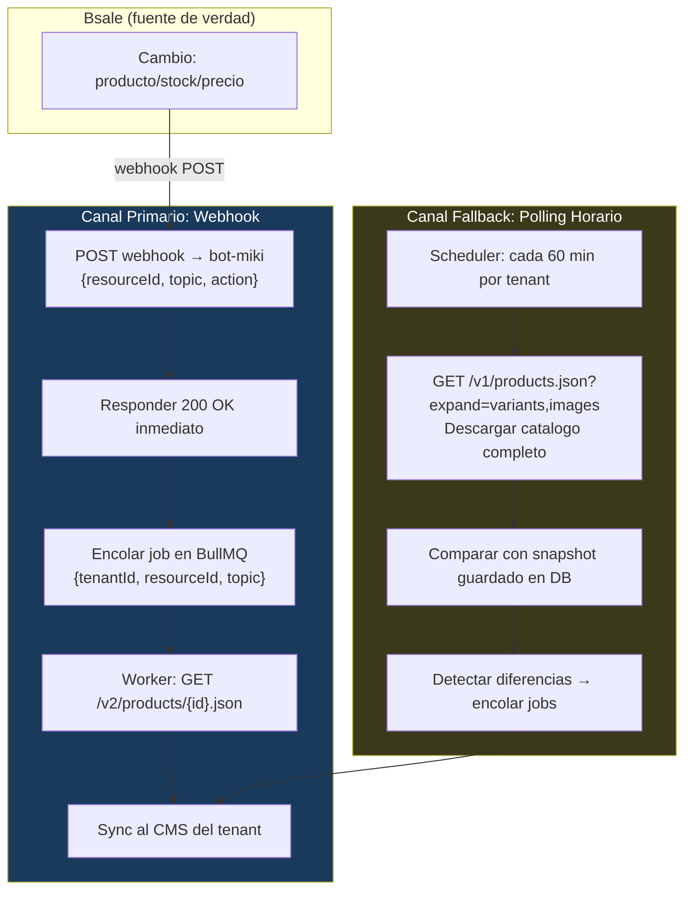

# ADR-004 — Estrategia de Sync: Webhooks + Polling Hibrido

**Estado:** Propuesto  
**Fecha:** 2026-05-22  
**Basado en:** [Investigacion Bsale API](../investigation/bsale-api-findings.md)

---

## Contexto

La investigacion de la API de Bsale revelo dos hechos que determinan la arquitectura de sync automatico:

1. **Bsale SI tiene webhooks** para los eventos relevantes (product, variant, stock, price)
2. **Bsale NO tiene filtro `updated_since`** en el endpoint de productos — el polling completo es caro

Adicionalmente:
- Los webhooks entregan solo metadata (ID + resource URL), no el objeto completo
- El registro de webhooks es manual (via email a Bsale, no via API)
- La politica de reintentos de webhooks no esta documentada (asumir: no reintenta)

---

## Decision

**Arquitectura hibrida: Webhooks como canal primario + Polling horario como fallback.**



---

## Flujo del Canal Primario (Webhooks)

```
1. Bsale dispara webhook POST a https://api.kpcrop.com/v1/webhooks/bsale
2. bot-miki responde 200 OK en < 500ms (sin procesar aun)
3. bot-miki encola job en BullMQ: {tenantId, resourceId, topic, action}
4. Worker obtiene datos completos: GET https://api.bsale.io{resource}
5. Adapter mapea a CanonicalProduct
6. Plugin CMS recibe comando de sync
7. Registro en Event Log
```

**Sync lag esperado:** < 30 segundos desde el cambio en Bsale hasta reflejo en el CMS.

## Flujo del Canal Fallback (Polling)

```
1. Scheduler ejecuta cron por tenant (configurable, default: cada 60 min)
2. Worker descarga catalogo completo: GET /v1/products.json?expand=[variants,images]
3. Itera paginas (limit=50) hasta agotar total_pages
4. Compara hash de cada variante con snapshot guardado en PostgreSQL
5. Para variantes con diferencia: encolar job de sync (mismo worker que webhooks)
6. Actualizar snapshot en DB
```

**Sync lag esperado:** Maximo 60 minutos (frecuencia del polling de fallback).

---

## Implicaciones Tecnicas

### Endpoint receptor de webhooks en bot-miki

```typescript
// packages/bot-miki/src/routes/webhooks.ts

fastify.post('/v1/webhooks/bsale', async (request, reply) => {
  const payload = request.body as BsaleWebhookPayload;

  // Validar que el resource apunta a api.bsale.io (anti-spoofing)
  if (!payload.resource?.startsWith('/v')) {
    return reply.code(400).send({ error: 'invalid_resource' });
  }

  // Identificar tenant por cpnId
  const tenant = await tenantRepo.findByCpnId(payload.cpnId);
  if (!tenant) {
    return reply.code(200).send(); // 200 para que Bsale no reintente con tenants desconocidos
  }

  // Encolar inmediatamente y devolver 200
  await syncQueue.add('bsale-webhook', {
    tenantId: tenant.id,
    resourceUrl: payload.resource,
    resourceId: payload.resourceId,
    topic: payload.topic,
    action: payload.action,
  }, {
    jobId: `webhook:${tenant.id}:${payload.topic}:${payload.resourceId}:${payload.send}`,
  });

  return reply.code(200).send();
});
```

### Snapshot para deteccion de cambios en polling

```sql
-- Tabla para comparacion eficiente en polling
CREATE TABLE bsale_variant_snapshots (
    tenant_id       VARCHAR(100) NOT NULL,
    variant_id      INTEGER NOT NULL,
    content_hash    VARCHAR(64) NOT NULL,  -- SHA256 de {price, stock, name, state}
    last_seen_at    TIMESTAMPTZ NOT NULL DEFAULT now(),
    PRIMARY KEY (tenant_id, variant_id)
);
```

El polling no compara objetos completos — compara hashes de los campos relevantes (precio, stock, nombre, estado activo). Si el hash cambio, hay que sincronizar.

### Rate Limiting del cliente HTTP de Bsale

```typescript
// Limite conservador de 10 req/s hasta confirmar el limite real de Bsale
// Implementar desde el primer dia — no agregar despues cuando ya hay tenants en produccion
const bsaleClient = new BsaleHttpClient({
  rateLimit: { requests: 10, per: 'second' },
  retryOn: [429, 500, 502, 503, 504],
  retryDelay: 'exponential',
});
```

---

## Friction Point: Registro Manual de Webhooks

El proceso de activar el canal primario para un nuevo cliente en tier Growth requiere:

1. Cliente instala el plugin y configura su Bsale API token
2. **kpcrop envia email a ayuda@bsale.app** con la URL del demonio y el `cpnId` del cliente
3. Bsale configura el webhook (tiempo de respuesta: 1-3 dias habiles)
4. Cliente recibe notificacion de que el sync automatico esta activo

**Mientras el webhook no esta activo**, el cliente opera en modo polling solamente (sync lag de 60 min en lugar de 30s).

**Plan para reducir este friction:**
- Corto plazo: Automatizar el email a Bsale con un template estandar desde el dashboard
- Mediano plazo: Negociar con Bsale acceso a API de registro de webhooks
- Largo plazo: Convertirse en partner oficial de Bsale para tener acceso programatico

---

## Consecuencias

**Positivas:**
- Sync en tiempo real (< 30s) para clientes con webhooks activos
- El polling de fallback garantiza consistencia eventual aunque Bsale no reintente webhooks
- La arquitectura es la misma para ambos canales — el mismo worker procesa jobs de webhook y de polling

**Negativas:**
- El onboarding del sync automatico tiene un paso manual (email a Bsale)
- Cada webhook consume 2 requests de rate limit (recepcion del evento + fetch del objeto)
- El polling completo es caro en rate limits para catalogos grandes: 20 calls por 1000 productos por tenant

**Riesgos:**
- Si Bsale impone rate limits por IP (en lugar de por API Key), todos los tenants comparten el pool
- Si Bsale algun dia depreca webhooks o cambia la estructura del payload, el canal primario falla silenciosamente

---

## Alternativas Consideradas

**Solo polling:** Rechazado. Sin `updated_since`, el costo de requests es O(catalogo_total) por tenant por ciclo. Con 100 tenants y catalogos de 1000 productos: 2000+ requests/hora solo para sync de productos.

**Solo webhooks:** Rechazado. Sin politica de reintentos documentada de Bsale, un downtime del demonio pierde eventos permanentemente. El polling de fallback es obligatorio.

**Polling frecuente (cada 5 min) como primario:** Rechazado. Consumiria rate limits de forma insostenible y la latencia (5 min) es peor que webhooks. Solo aceptable si Bsale confirma que no tiene rate limits — improbable.
