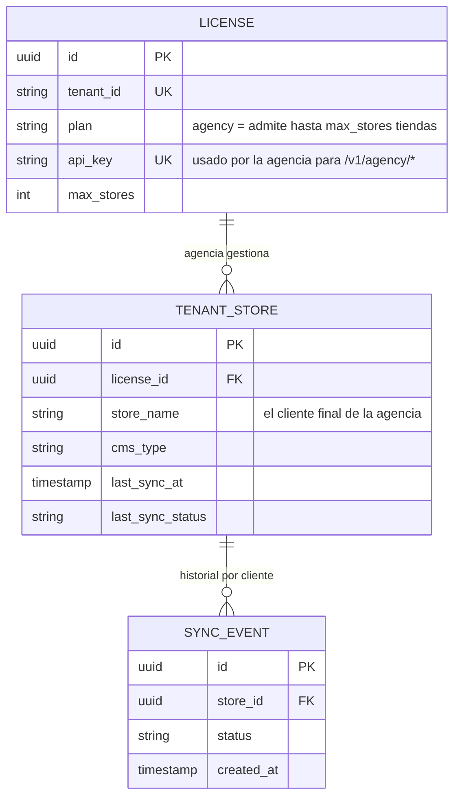

# ADR-005 — Arquitectura Sub-tenant para el Canal Agencias

**Estado:** Aceptado — implementado en `src/routes/agency.ts`
**Fecha:** 2026-07-23
**Autores:** Equipo kpcrop-latam
**Issue:** #54

---

## Contexto

El canal Agencias necesita que una agencia (un solo tenant/licencia) gestione múltiples tiendas
de sus clientes finales bajo una sola cuenta, cada una con su propia config de Bsale y CMS. El
issue #54 pide explícitamente decidir esto **antes** de escribir código: ¿reusar el modelo
`tenant → stores` que ya existe, o agregar una capa nueva "agencia"?

---

## Decisión

**Se reusa el modelo existente sin cambios de esquema.** Una agencia ES un tenant/`licenses` row
(con `plan = 'agency'`); cada cliente de la agencia es simplemente una fila más en
`tenant_stores` bajo ese mismo `license_id`. No hace falta ninguna tabla ni columna nueva — la
relación 1-a-N entre `licenses` y `tenant_stores` (definida desde `001_initial_schema.sql`) ya
modela exactamente "una cuenta → muchas tiendas".

### Por qué no agregar una capa "agency" separada

Una capa nueva (ej. tabla `agencies` con `agency_id` en `licenses`) tendría sentido si una
agencia necesitara administrar **múltiples licencias** de clientes que pagan por separado. Ese
no es el modelo de negocio actual (ver `docs/business/pricing-strategy.md`): la agencia paga
**una** licencia (`plan=agency`, `max_stores` alto) y sus clientes no tienen licencia propia ni
facturación individual — son solo tiendas dentro de la cuenta de la agencia. Agregar una capa
para eso hoy sería especular sobre un modelo de precios que no existe.

### Permisos

El issue marcaba como **opcional** que "el cliente final vea solo su tienda". Se deja **fuera de
alcance** en esta iteración: hoy no existe ningún concepto de identidad/login para un cliente
final (ni humano ni API) — la única credencial que existe es el `api_key` del tenant completo
(la agencia). Implementar acceso restringido por cliente requeriría un sistema de identidad
nuevo (sub-API-keys o JWT con scope por `store_id`), que es una pieza sustancialmente más grande
y no la pidió el canal agencias para el lanzamiento. Queda documentado como trabajo futuro, no
bloquea #55.

### Superficie nueva: `/v1/agency/*`

Lo que sí es nuevo es la **superficie de API self-service** — hoy la única forma de listar/
gestionar tiendas de un tenant es vía `/v1/admin/*`, protegido por `X-Admin-Key` (el secreto
interno de kpcrop, no algo que la agencia tenga). El gap real que cierra #55 es exponer un
subconjunto de esas capacidades autenticado con el **propio** `api_key` de la agencia
(`X-API-Key`, el mismo que ya usa el plugin CMS), scoped estrictamente a `WHERE license_id =
<la licencia del caller>` — nunca a otro tenant. Ver `src/routes/agency.ts`.

---

## Consecuencias

**Positivas:**
- Cero migración de base de datos — el modelo ya soportaba esto.
- La agencia usa la misma credencial (`api_key`) que ya tiene, sin gestión de accesos nueva.
- El aislamiento entre clientes de una misma agencia (criterio de aceptación de #55: "los
  errores de sync de un cliente no afectan a los demás") es automático — cada `tenant_stores`
  row tiene su propio ciclo de sync independiente vía BullMQ, no hay estado compartido.

**Negativas / deuda aceptada:**
- Sin acceso restringido por cliente final — cualquiera con el `api_key` de la agencia ve y
  puede disparar sync en TODAS las tiendas de esa cuenta. Aceptable porque hoy el `api_key` ya
  es la única credencial de toda la cuenta (el plugin CMS de cada tienda individual también lo
  usa hoy sin scoping), así que no es una regresión de seguridad, solo una limitación conocida.
- `max_stores` sigue sin enforcement real (ver issue de política de licencia, #127) — nada impide
  hoy que una agencia tenga más tiendas que su `max_stores` configurado.
