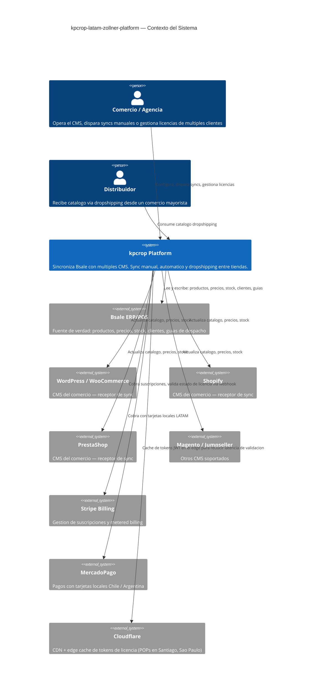
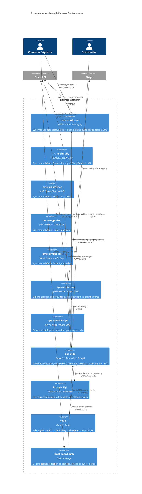

# C4 — Nivel de Contexto

Vista de alto nivel del sistema y sus actores e integraciones externas.

```mermaid
C4Context
    title kpcrop-latam-zollner-platform — Contexto del Sistema

    Person(comercio, "Comercio / Agencia", "Opera el CMS, dispara syncs manuales o gestiona licencias de multiples clientes")
    Person(distribuidor, "Distribuidor", "Recibe catalogo via dropshipping desde un comercio mayorista")

    System(platform, "kpcrop Platform", "Sincroniza Bsale con multiples CMS. Sync manual, automatico y dropshipping entre tiendas.")

    System_Ext(bsale, "Bsale ERP/POS", "Fuente de verdad: productos, precios, stock, clientes, guias de despacho")
    System_Ext(wordpress, "WordPress / WooCommerce", "CMS del comercio — receptor de sync")
    System_Ext(shopify, "Shopify", "CMS del comercio — receptor de sync")
    System_Ext(prestashop, "PrestaShop", "CMS del comercio — receptor de sync")
    System_Ext(otros, "Magento / Jumpseller", "Otros CMS soportados")
    System_Ext(stripe, "Stripe Billing", "Gestion de suscripciones y metered billing")
    System_Ext(mp, "MercadoPago", "Pagos con tarjetas locales Chile / Argentina")
    System_Ext(cloudflare, "Cloudflare", "CDN + edge cache de tokens de licencia (POPs en Santiago, Sao Paulo)")

    Rel(comercio, platform, "Configura, dispara syncs, gestiona licencias")
    Rel(distribuidor, platform, "Consume catalogo dropshipping")
    Rel(platform, bsale, "Lee y escribe: productos, precios, stock, clientes, guias")
    Rel(platform, wordpress, "Actualiza catalogo, precios, stock")
    Rel(platform, shopify, "Actualiza catalogo, precios, stock")
    Rel(platform, prestashop, "Actualiza catalogo, precios, stock")
    Rel(platform, otros, "Actualiza catalogo, precios, stock")
    Rel(platform, stripe, "Cobra suscripciones, valida estado de licencia via webhook")
    Rel(platform, mp, "Cobra con tarjetas locales LATAM")
    Rel(platform, cloudflare, "Cache de tokens JWT en el edge para reducir latencia de validacion")
```

---

## C4 — Nivel de Contenedor

Vista interna de los contenedores que componen la plataforma.

```mermaid
C4Container
    title kpcrop-latam-zollner-platform — Contenedores

    Person(comercio, "Comercio / Agencia")
    Person(distribuidor, "Distribuidor")

    System_Ext(bsale, "Bsale API")
    System_Ext(stripe, "Stripe")

    System_Boundary(platform, "kpcrop Platform") {
        Container(plugin_wp, "cms-wordpress", "PHP / WordPress Plugin", "Sync manual: productos, precios, stock, clientes, guias desde Bsale al CMS")
        Container(plugin_sh, "cms-shopify", "Node.js / Shopify App", "Sync manual desde Bsale a Shopify via Shopify Admin API")
        Container(plugin_ps, "cms-prestashop", "PHP / PrestaShop Module", "Sync manual desde Bsale a PrestaShop")
        Container(plugin_mg, "cms-magento", "PHP / Magento 2 Module", "Sync manual desde Bsale a Magento")
        Container(plugin_jm, "cms-jumpseller", "Node.js / Jumpseller App", "Sync manual desde Bsale a Jumpseller")
        Container(servi_dropi, "app-servi-dropi", "PHP o Node / Plugin CMS", "Expone catalogo de productos para dropshipping a distribuidores")
        Container(client_dropi, "app-client-dropi", "PHP o Node / Plugin CMS", "Consume catalogo del servidor, sync programada")
        Container(bot_miki, "bot-miki", "Node.js + TypeScript + Fastify", "Demonio: scheduler, cola BullMQ, reintentos, licencias, event log, API REST")
        Container(db, "PostgreSQL", "Base de datos relacional", "Licencias, configuracion de tenants, event log de syncs")
        Container(redis, "Redis", "Cache + Cola", "Tokens JWT con TTL, cola BullMQ, cache de respuestas Bsale")
        Container(dashboard, "Dashboard Web", "React / Next.js", "UI para agencias: gestion de licencias, estado de syncs, alertas")
    }

    Rel(comercio, plugin_wp, "Dispara sync manual", "HTTP / Admin UI")
    Rel(comercio, dashboard, "Gestiona tenants y licencias", "HTTPS")
    Rel(distribuidor, servi_dropi, "Configura catalogo dropshipping")
    Rel(client_dropi, servi_dropi, "Consume catalogo", "HTTP")
    Rel(plugin_wp, bsale, "Lee productos/stock/precios", "HTTPS / Bsale API")
    Rel(plugin_sh, bsale, "Lee productos/stock/precios", "HTTPS / Bsale API")
    Rel(plugin_wp, bot_miki, "Valida licencia / reporta sync", "HTTPS / REST")
    Rel(plugin_sh, bot_miki, "Valida licencia / reporta sync", "HTTPS / REST")
    Rel(bot_miki, plugin_wp, "Envia comandos de sync programada", "Webhook / HTTP")
    Rel(bot_miki, bsale, "Sync automatica con reintentos", "HTTPS / Bsale API")
    Rel(bot_miki, stripe, "Valida estado de suscripcion", "HTTPS")
    Rel(bot_miki, db, "Lee/escribe licencias, event log", "TCP / PostgreSQL")
    Rel(bot_miki, redis, "Cola BullMQ, cache tokens", "TCP / Redis")
    Rel(dashboard, bot_miki, "Consulta estado tenants", "HTTPS / REST")
```
