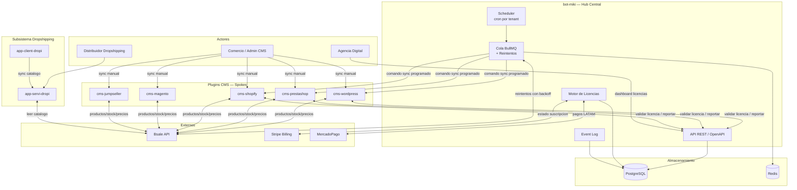

# Arquitectura Global — kpcrop-latam-zollner-platform

## Vision

Plataforma de sincronizacion bidireccional entre **Bsale** (ERP/POS fuente de verdad) y multiples CMS de comercio electronico. Opera en tres modos: sync manual on-demand, sync automatico programable via demonio, y dropshipping entre dos instancias CMS.

---

## Tipo de Arquitectura

**Hub-and-Spoke con monolito modular**

- Los **plugins CMS** son los Spokes: se despliegan dentro del runtime del CMS host (PHP, Node) y operan sin estado propio
- **bot-miki** es el Hub: proceso largo que mantiene el Event Log, la cola de jobs, y la autoridad sobre licencias
- El par **servi-dropi / client-dropi** es un subsistema de catalogo P2P construido sobre los mismos adaptadores CMS

---

## Bounded Contexts

| Context | Responsabilidad | Componentes |
|---|---|---|
| **Sync Manual** | Operaciones on-demand disparadas por un humano | `cms-*` plugins |
| **Sync Automatico** | Cola, scheduling, reintentos, estado de jobs | `bot-miki` |
| **Dropshipping** | Exposicion y consumo de catalogo entre pares CMS | `app-servi-dropi`, `app-client-dropi` |
| **Licencias** | Validacion, activacion, revocacion, billing | Modulo en `bot-miki` |
| **Adaptadores CMS** | Traduccion entre Canonical Model y API de cada CMS | `shared` + `cms-*` |

---

## Flujos Principales

- [Sync Manual](./flows/sync-manual.md)
- [Sync Automatico](./flows/sync-auto.md)
- [Dropshipping](./flows/dropshipping.md)
- [Validacion de Licencias](./flows/license-validation.md)

---

## Decisiones Tecnicas (ADR)

- [ADR-001 — Canonical Product Model](../adr/ADR-001-canonical-product-model.md)
- [ADR-002 — Stack Tecnologico](../adr/ADR-002-technology-stack.md)
- [ADR-003 — Cola de Tareas e Idempotencia](../adr/ADR-003-queue-idempotency.md)

---

## Riesgos Criticos

| # | Riesgo | Impacto | Mitigacion |
|---|---|---|---|
| R1 | bot-miki es SPOF | Alto | HA en Railway/ECS; health checks + alertas |
| R2 | Acoplamiento licencias en tiempo real | Medio | JWT firmado con TTL en Redis (Cloudflare edge cache) |
| R3 | Sin Canonical Product Model | Alto | ADR-001 antes de cualquier adapter |
| R4 | Idempotencia no garantizada | Alto | Clave `{tenantId}:{tipo}:{entidadId}:{fecha}` en cada job |
| R5 | Dropshipping P2P no escala | Medio | Broker central en v2 para mayoristas con 50+ distribuidores |
