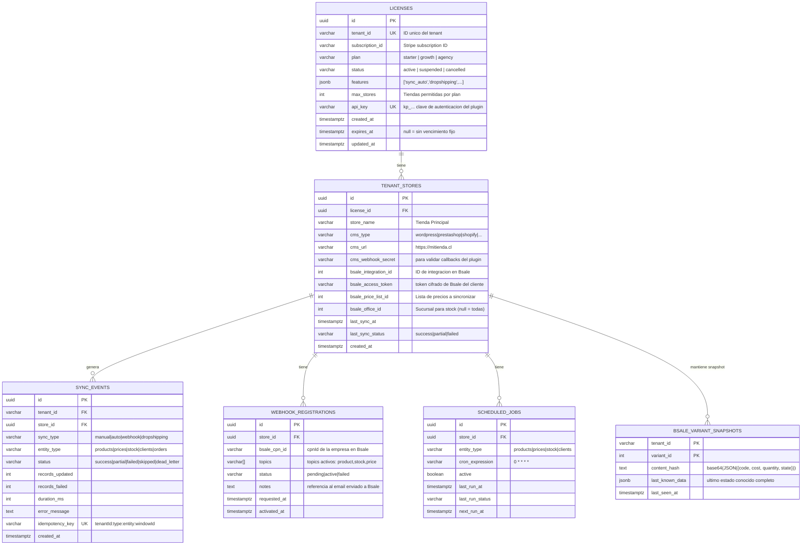
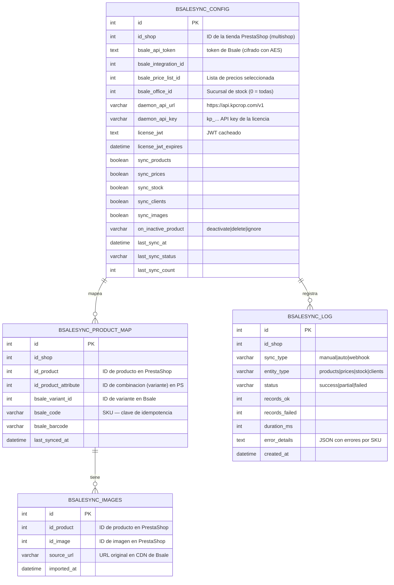
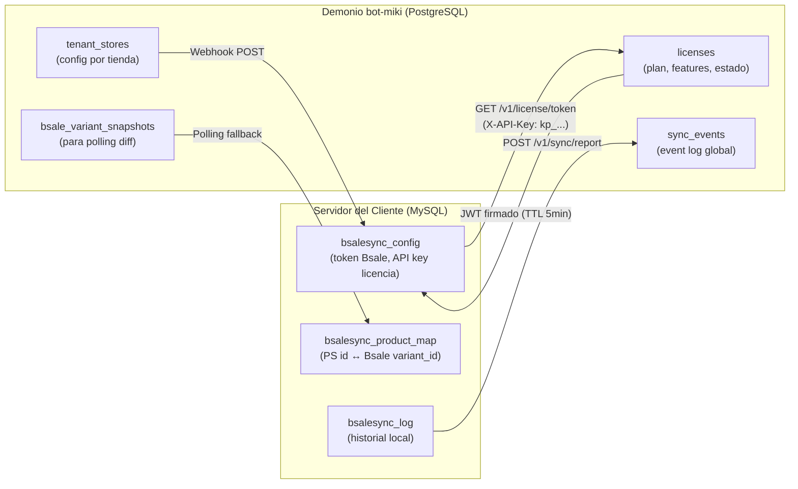

# Esquema de Base de Datos

Dos bases de datos independientes: **PostgreSQL** (bot-miki) y **MySQL** (plugin PrestaShop en el servidor del cliente).

---

## PostgreSQL — bot-miki



---

## MySQL — Plugin PrestaShop (en el servidor del cliente)



---

## SQL de Creacion — PostgreSQL (bot-miki)

```sql
-- migrations/001_initial_schema.sql

CREATE EXTENSION IF NOT EXISTS "pgcrypto";

CREATE TABLE licenses (
    id              UUID PRIMARY KEY DEFAULT gen_random_uuid(),
    tenant_id       VARCHAR(100) UNIQUE NOT NULL,
    subscription_id VARCHAR(100) NOT NULL,
    plan            VARCHAR(20) NOT NULL CHECK (plan IN ('starter','growth','agency')),
    status          VARCHAR(20) NOT NULL DEFAULT 'active'
                        CHECK (status IN ('active','suspended','cancelled')),
    features        JSONB NOT NULL DEFAULT '[]',
    max_stores      INTEGER NOT NULL DEFAULT 1,
    api_key         VARCHAR(64) UNIQUE NOT NULL,
    created_at      TIMESTAMPTZ NOT NULL DEFAULT now(),
    expires_at      TIMESTAMPTZ,
    updated_at      TIMESTAMPTZ NOT NULL DEFAULT now()
);

CREATE TABLE tenant_stores (
    id                      UUID PRIMARY KEY DEFAULT gen_random_uuid(),
    license_id              UUID NOT NULL REFERENCES licenses(id) ON DELETE CASCADE,
    store_name              VARCHAR(200) NOT NULL,
    cms_type                VARCHAR(30) NOT NULL
                                CHECK (cms_type IN ('wordpress','prestashop','shopify',
                                                    'woocommerce','magento','jumpseller')),
    cms_url                 VARCHAR(500) NOT NULL,
    cms_webhook_secret      VARCHAR(64),
    bsale_integration_id    INTEGER,
    bsale_access_token      TEXT,
    bsale_price_list_id     INTEGER,
    bsale_office_id         INTEGER,
    last_sync_at            TIMESTAMPTZ,
    last_sync_status        VARCHAR(20),
    created_at              TIMESTAMPTZ NOT NULL DEFAULT now()
);

CREATE TABLE sync_events (
    id                UUID PRIMARY KEY DEFAULT gen_random_uuid(),
    tenant_id         VARCHAR(100) NOT NULL,
    store_id          UUID REFERENCES tenant_stores(id),
    sync_type         VARCHAR(20) NOT NULL
                          CHECK (sync_type IN ('manual','auto','webhook','dropshipping')),
    entity_type       VARCHAR(20) NOT NULL
                          CHECK (entity_type IN ('products','prices','stock',
                                                 'clients','orders','guides')),
    status            VARCHAR(20) NOT NULL
                          CHECK (status IN ('success','partial','failed',
                                           'skipped','dead_letter')),
    records_updated   INTEGER DEFAULT 0,
    records_failed    INTEGER DEFAULT 0,
    duration_ms       INTEGER,
    error_message     TEXT,
    idempotency_key   VARCHAR(200) UNIQUE,
    created_at        TIMESTAMPTZ NOT NULL DEFAULT now()
);

CREATE TABLE bsale_variant_snapshots (
    tenant_id       VARCHAR(100) NOT NULL,
    variant_id      INTEGER NOT NULL,
    content_hash    TEXT NOT NULL,     -- base64(JSON({code, cost, quantity, state}))
    last_known_data JSONB,             -- estado completo de la variante (para debug)
    last_seen_at    TIMESTAMPTZ NOT NULL DEFAULT now(),
    PRIMARY KEY (tenant_id, variant_id)
);

CREATE TABLE webhook_registrations (
    id              UUID PRIMARY KEY DEFAULT gen_random_uuid(),
    store_id        UUID NOT NULL REFERENCES tenant_stores(id) ON DELETE CASCADE,
    bsale_cpn_id    VARCHAR(50) NOT NULL,
    topics          VARCHAR(30)[] NOT NULL DEFAULT '{}',
    status          VARCHAR(20) NOT NULL DEFAULT 'pending'
                        CHECK (status IN ('pending','active','failed')),
    notes           TEXT,
    requested_at    TIMESTAMPTZ NOT NULL DEFAULT now(),
    activated_at    TIMESTAMPTZ
);

CREATE TABLE scheduled_jobs (
    id              UUID PRIMARY KEY DEFAULT gen_random_uuid(),
    store_id        UUID NOT NULL REFERENCES tenant_stores(id) ON DELETE CASCADE,
    entity_type     VARCHAR(20) NOT NULL,
    cron_expression VARCHAR(50) NOT NULL DEFAULT '0 * * * *',
    active          BOOLEAN NOT NULL DEFAULT true,
    last_run_at     TIMESTAMPTZ,
    last_run_status VARCHAR(20),
    next_run_at     TIMESTAMPTZ
);

-- Indices para queries frecuentes
CREATE INDEX idx_sync_events_tenant_date ON sync_events (tenant_id, created_at DESC);
CREATE INDEX idx_sync_events_store ON sync_events (store_id, created_at DESC);
CREATE INDEX idx_tenant_stores_license ON tenant_stores (license_id);
CREATE INDEX idx_snapshots_tenant ON bsale_variant_snapshots (tenant_id);
```

---

## Flujo de Datos entre Bases de Datos



---

## Notas de Seguridad

**bot-miki (PostgreSQL):**
- `bsale_access_token` debe cifrarse en reposo con AES-256 usando una clave separada del JWT_SECRET
- `api_key` se almacena como hash (bcrypt) — nunca en texto plano
- Las columnas de tokens no deben aparecer en logs de queries

**Plugin PrestaShop (MySQL):**
- `bsale_api_token` se cifra con `openssl_encrypt()` usando la `_COOKIE_KEY_` de PrestaShop como clave
- El `daemon_api_key` se almacena tal cual (es la clave del tenant, no un secreto critico)
- La tabla `bsalesync_config` no debe ser accesible desde el front-end de la tienda
