# Estrategia de Manejo de Errores

Cada capa del sistema tiene errores distintos con estrategias distintas. Este documento define el comportamiento esperado en cada caso.

---

## Mapa de Errores por Capa

```mermaid
flowchart TD
    subgraph PS["Plugin PrestaShop"]
        E1["Bsale API no disponible"]
        E2["Licencia expirada"]
        E3["SKU sin categoria en PS"]
        E4["Imagen no descargable"]
        E5["Timeout PHP (max_exec)"]
    end

    subgraph BM["bot-miki"]
        E6["PostgreSQL no disponible"]
        E7["Redis no disponible"]
        E8["Bsale rate limit (429)"]
        E9["Webhook payload invalido"]
        E10["Job en dead letter queue"]
    end

    E1 -->|"Mostrar error + reintentar manual"| U["Admin CMS"]
    E2 -->|"Bloquear sync + mostrar aviso renovacion"| U
    E3 -->|"Registrar error + continuar con siguiente SKU"| LOG["Log de sync"]
    E4 -->|"Omitir imagen + continuar"| LOG
    E5 -->|"Procesar en lotes mas pequenos o via CLI"| U

    E6 -->|"Fastify responde 503 + Railway reinicia"| MON["Monitoring"]
    E7 -->|"Fallback: procesar sin cola (directo)"| MON
    E8 -->|"Backoff segun Retry-After + reintentar"| Q["Cola BullMQ"]
    E9 -->|"Responder 200 (no reintentar) + log warn"| LOG
    E10 -->|"Alerta Slack + log dead_letter"| SLACK["Slack #alertas"]
```



---

## Clasificacion de Errores

### Errores Recuperables (reintentar)
- Bsale devuelve 5xx o timeout → esperar + reintentar con backoff exponencial
- Bsale devuelve 429 → esperar segun `Retry-After` + reintentar
- PostgreSQL temporalmente no disponible → Railway reinicia automaticamente
- Red inestable entre plugin y demonio → reintentar en siguiente sync

### Errores No Recuperables (registrar y continuar)
- Bsale devuelve 401/403 → token invalido, requiere accion humana
- SKU tiene datos invalidos (precio negativo, nombre vacio) → saltar ese SKU, continuar con el resto
- Imagen con URL invalida o expirada → sincronizar producto sin imagen
- Producto sin variantes en Bsale → saltar, registrar warning

### Errores Criticos (alertar y no reintentar)
- Licencia expirada → bloquear toda operacion de sync, mostrar aviso prominente al admin
- `JWT_SECRET` invalido en bot-miki → proceso muere, Railway reinicia, alertar

---

## Comportamiento por Escenario

### Escenario 1: Bsale API no disponible durante sync manual

```
Plugin PrestaShop:
  → Catch BsaleApiException (5xx/timeout)
  → Mostrar en UI: "Error de conexion con Bsale. Intentalo de nuevo en unos minutos."
  → Registrar en bsalesync_log: status='failed', error_message='HTTP 503'
  → NO reintentar automaticamente (es sync manual — el admin decide)
```

### Escenario 2: Bsale API no disponible durante sync automatico (bot-miki)

```
Worker BullMQ:
  → Job lanza BsaleApiError(503)
  → BullMQ marca el job como fallido
  → Esperar 30s → reintentar
  → Si falla 5 veces: mover a Dead Letter Queue
  → Registrar en sync_events: status='dead_letter'
  → Enviar alerta a Slack
```

### Escenario 3: 50 de 1000 productos tienen SKU duplicado en PrestaShop

```
BsaleSyncService:
  → Intentar UPSERT del producto (por reference = SKU)
  → Si la DB de PrestaShop tiene dos products con el mismo reference (data sucia):
    → Usar el ID del primero encontrado
    → Registrar warning: "SKU-XXX: se encontraron 2 productos, usando ID={id}"
  → Continuar con el siguiente producto
  → Al final: result.failed = 0, result.errors = [50 warnings]
  → Status del sync: 'success' (no 'partial') porque todos se procesaron
```

### Escenario 4: Licencia expirada detectada durante sync

```
LicenseClient:
  → GET /v1/license/token → HTTP 402
  → Lanzar LicenseException(402)

BsaleSyncService:
  → Catch LicenseException → NO continuar el sync

AdminBsaleSyncController:
  → Catch LicenseException
  → Mostrar en UI: "Tu licencia ha expirado. [Renovar en kpcrop.com/billing]"
  → Deshabilitar botones de sync

Sync automatico (bot-miki worker):
  → Detectar licencia expirada
  → Llamar job.discard() — NO reintentar
  → Registrar: sync_events.status = 'skipped', reason = 'license_expired'
```

### Escenario 5: Plugin PrestaShop supera max_execution_time de PHP

```
Catalogo grande (>3000 productos) + Apache con max_execution_time=60s:
  → La request HTTP del admin expira en 60s con error 500/504
  → El sync queda incompleto sin registro

Mitigacion:
  1. BsaleSyncService procesa en lotes y hace flush() del output buffer cada 100 productos
  2. Para catalogos grandes (>1000 productos): usar CLI en lugar del backoffice
     php /ruta/prestashop/modules/bsalesync/cli/sync.php products
  3. El CLI no tiene limite de tiempo de ejecucion PHP
```

---

## Formato de Error en API de bot-miki

Todos los errores de la API siguen este formato JSON:

```json
{
  "code": "LICENSE_EXPIRED",
  "message": "La licencia del tenant acme-store esta suspendida. Renueva en kpcrop.com/billing",
  "details": {
    "tenantId": "acme-store",
    "status": "suspended"
  }
}
```

### Codigos de error definidos

| Code | HTTP | Descripcion |
|---|---|---|
| `MISSING_API_KEY` | 401 | Falta header `X-API-Key` |
| `TENANT_NOT_FOUND` | 404 | Tenant o API Key no existe |
| `LICENSE_EXPIRED` | 402 | Licencia suspendida o cancelada |
| `FEATURE_NOT_INCLUDED` | 402 | El plan no incluye esta funcionalidad |
| `INVALID_PAYLOAD` | 400 | Body de la request invalido |
| `SYNC_CONFLICT` | 409 | Ya hay un sync en progreso para este tenant |
| `INTERNAL_ERROR` | 500 | Error inesperado (ver logs) |

---

## Observabilidad de Errores

### Logs estructurados (OpenTelemetry → Axiom)

Todo error debe loguearse con este schema minimo:

```typescript
app.log.error({
  tenantId:    'acme-store',
  storeId:     'uuid-...',
  operation:   'license.validate',
  errorCode:   'LICENSE_EXPIRED',
  httpStatus:  402,
  durationMs:  45,
}, 'License validation failed');
```

### Alertas automaticas

| Condicion | Alerta |
|---|---|
| Job en Dead Letter Queue | Slack #alertas inmediato |
| Tasa de error > 5% en 5 min | Slack #alertas |
| sync_events con status=failed > 50/hora | Slack #alertas |
| Licencias suspendidas aumentan > 5 en 1 dia | Email a comercial |
