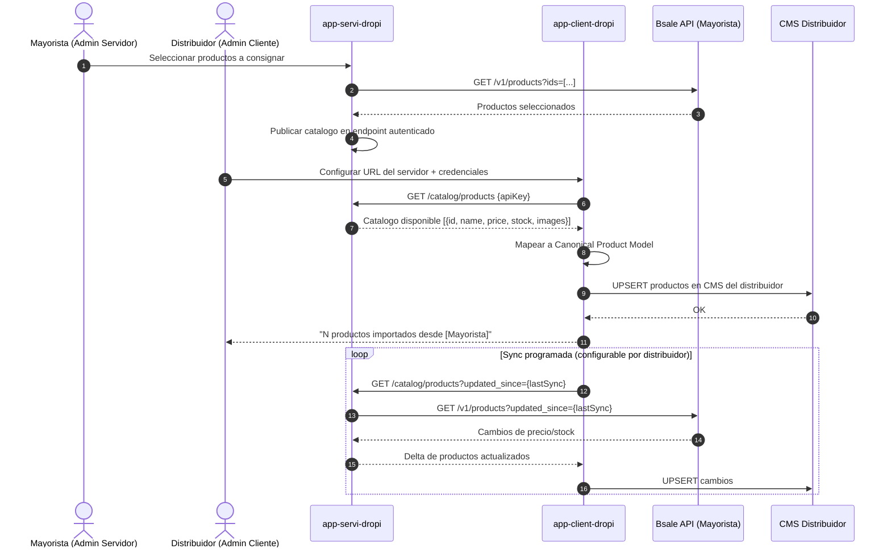
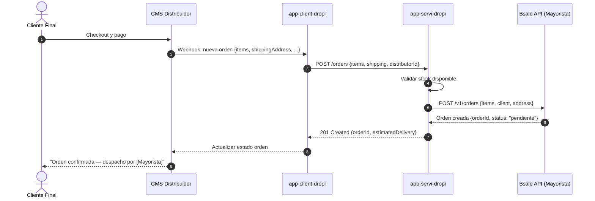

# Flujo: Dropshipping entre CMS

Un comercio mayorista (Servidor) expone su catalogo via `app-servi-dropi`. Un distribuidor (Cliente) consume ese catalogo via `app-client-dropi` y lo importa a su propio CMS. Ambos usan Bsale como fuente de verdad del servidor.

---

## Flujo de Orden Dropshipping (v2 — roadmap)

Cuando un cliente final compra en el CMS del distribuidor, la orden debe propagarse al mayorista para que este la procese en Bsale.

---

## Consideraciones de Seguridad

**Autenticacion entre servidor y cliente:** El servidor genera un `apiKey` unico por distribuidor. Las requests del cliente incluyen `Authorization: Bearer {apiKey}`. El servidor valida el key y registra el uso para facturacion.

**Isolation de catalogo:** El mayorista puede definir que productos son visibles para cada distribuidor — no todos los distribuidores ven el catalogo completo. La segmentacion es por `distributorId`.

**Precios diferenciados:** El servidor puede exponer precios de lista o precios especiales por distribuidor. La logica de precio diferenciado vive en `app-servi-dropi`, no en Bsale.

**Rate limiting:** El servidor debe limitar las requests del cliente para evitar que un distribuidor con sync muy frecuente sature la conexion a Bsale del mayorista.
