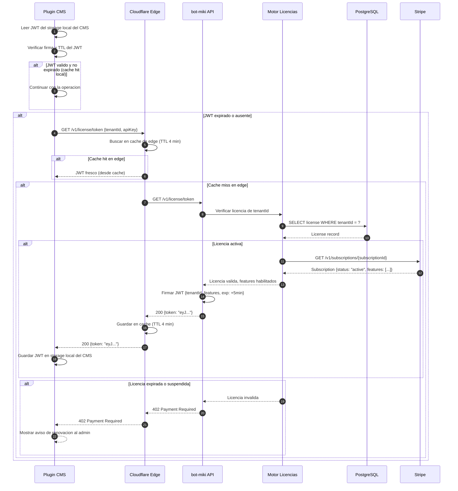
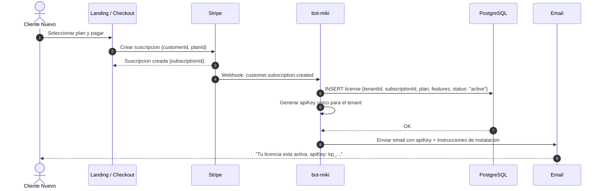
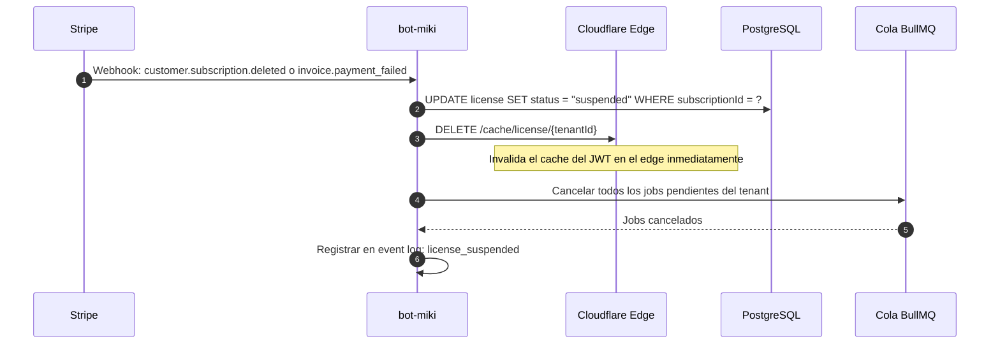

# Flujo: Validacion de Licencias

El sistema de licencias es el boundary critico de toda la plataforma. Todos los plugins CMS validan su licencia antes de ejecutar cualquier sync. La validacion debe ser rapida, disponible, y resistente a la latencia de red.

## Patron: JWT con Cache en Edge

Para evitar que cada operacion del plugin bloquee en la red al demonio, la licencia se representa como un **JWT firmado por bot-miki con TTL de 5 minutos**, cacheado en Cloudflare Workers (edge cache cercano al CMS del cliente en Chile/LATAM).



---

## Flujo de Activacion de Licencia (nuevo cliente)



---

## Flujo de Revocacion de Licencia



---

## Modelo de Datos: Licencias

```sql
-- Tabla principal de licencias
CREATE TABLE licenses (
    id              UUID PRIMARY KEY DEFAULT gen_random_uuid(),
    tenant_id       VARCHAR(100) UNIQUE NOT NULL,
    subscription_id VARCHAR(100) NOT NULL,          -- Stripe subscription ID
    plan            VARCHAR(50) NOT NULL,            -- starter | growth | agency
    status          VARCHAR(20) NOT NULL DEFAULT 'active', -- active | suspended | cancelled
    features        JSONB NOT NULL DEFAULT '[]',     -- ["sync_auto","dropshipping",...]
    max_stores      INTEGER NOT NULL DEFAULT 1,
    api_key         VARCHAR(64) UNIQUE NOT NULL,
    created_at      TIMESTAMPTZ NOT NULL DEFAULT now(),
    expires_at      TIMESTAMPTZ,
    updated_at      TIMESTAMPTZ NOT NULL DEFAULT now()
);

-- Sub-cuentas para agencias (una agencia → N tiendas)
CREATE TABLE tenant_stores (
    id          UUID PRIMARY KEY DEFAULT gen_random_uuid(),
    license_id  UUID NOT NULL REFERENCES licenses(id),
    store_name  VARCHAR(200) NOT NULL,
    cms_type    VARCHAR(50) NOT NULL,              -- wordpress | shopify | prestashop | ...
    cms_url     VARCHAR(500) NOT NULL,
    bsale_integration_id INTEGER,
    created_at  TIMESTAMPTZ NOT NULL DEFAULT now()
);

-- Event log de sincronizaciones
CREATE TABLE sync_events (
    id              UUID PRIMARY KEY DEFAULT gen_random_uuid(),
    tenant_id       VARCHAR(100) NOT NULL,
    store_id        UUID REFERENCES tenant_stores(id),
    sync_type       VARCHAR(50) NOT NULL,           -- manual | auto | dropshipping
    entity_type     VARCHAR(50) NOT NULL,           -- products | prices | stock | clients
    status          VARCHAR(20) NOT NULL,           -- success | partial | failed | skipped
    records_updated INTEGER DEFAULT 0,
    duration_ms     INTEGER,
    error_message   TEXT,
    idempotency_key VARCHAR(200) UNIQUE,
    created_at      TIMESTAMPTZ NOT NULL DEFAULT now()
);
```
