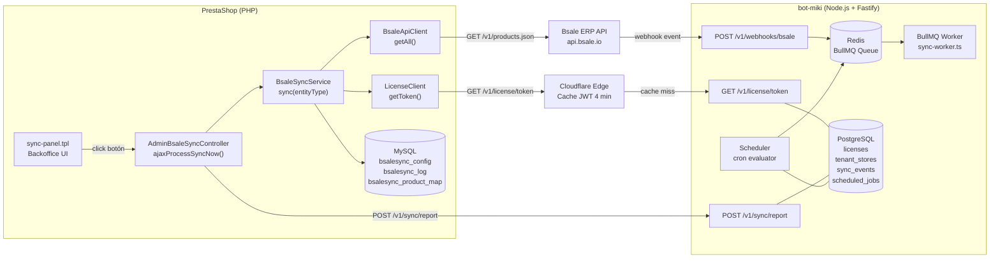
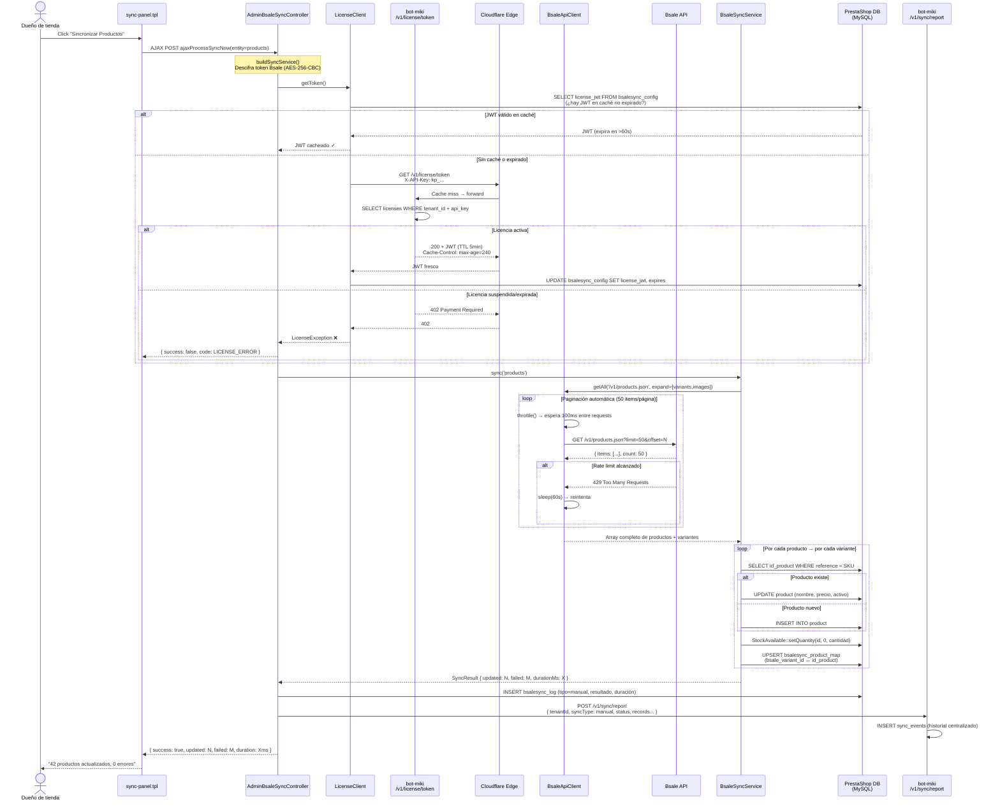
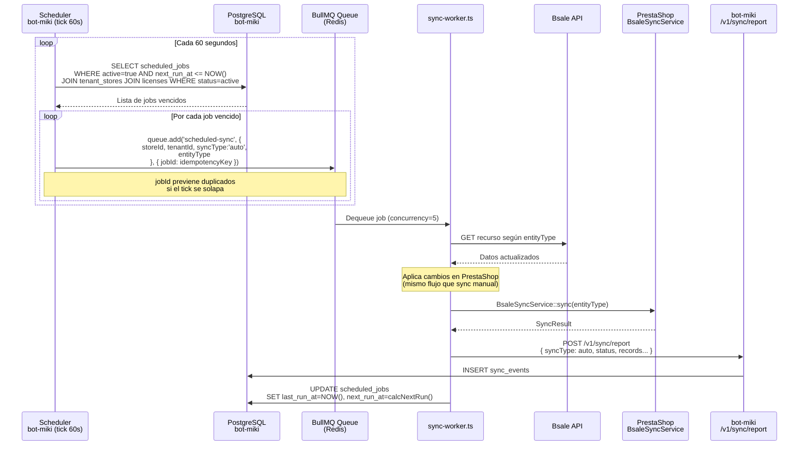
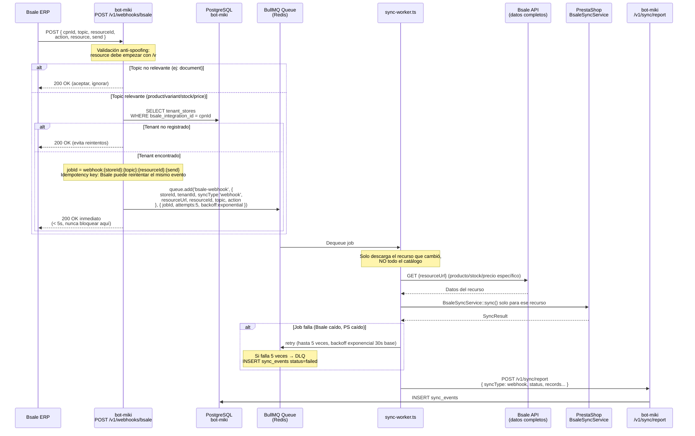
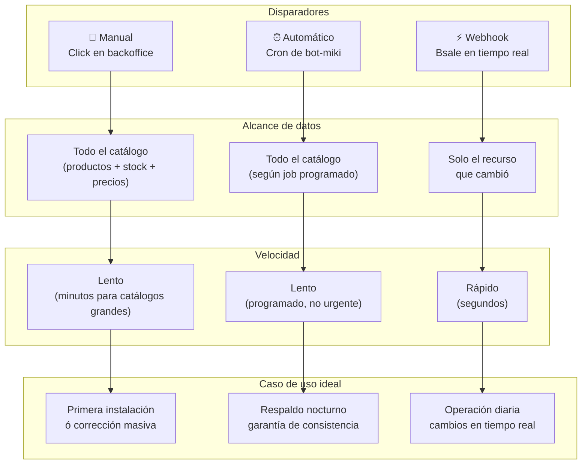

# Flujos de Sincronización — Plugin PrestaShop

Diagrama end-to-end de los tres modos de sincronización entre Bsale ERP y PrestaShop a través del hub bot-miki.

---

## Componentes involucrados



---

## Modo 1 — Sincronización Manual

El dueño de tienda inicia el proceso desde el backoffice de PrestaShop.



---

## Modo 2 — Sincronización Automática (Scheduler)

bot-miki evalúa los jobs programados y lanza syncs sin intervención del usuario.



---

## Modo 3 — Webhook en Tiempo Real

Bsale notifica a bot-miki cuando cambia un producto, precio o stock.



---

## Comparación de los tres modos



---

## Flujo de validación de licencia (detalle)

```mermaid
flowchart TD
    A["Plugin necesita operar\n(sync manual, auto o webhook)"] --> B

    B{"¿JWT en caché\nbsalesync_config?\n(expira en >60s)"}
    B -->|Sí| C["Usa JWT cacheado\n✓ Sin red"]
    B -->|No| D["GET /v1/license/token\nX-API-Key: kp_..."]

    D --> E{"Cloudflare Edge\n¿Cache hit?"}
    E -->|Hit (4 min TTL)| F["Responde desde edge\n✓ Sin tocar bot-miki"]
    E -->|Miss| G["bot-miki consulta\nPostgreSQL licenses"]

    G --> H{"¿Existe tenant\n+ api_key?"}
    H -->|No| I["404 → LicenseException\n❌ Plugin bloqueado"]
    H -->|Sí| J{"¿status = active?"}

    J -->|suspended/cancelled| K["402 → LicenseException\n❌ Renueva en kpcrop.com/billing"]
    J -->|active| L["Genera JWT HS256\nTTL 5 min\nCache-Control: max-age=240"]

    L --> M["Plugin guarda JWT\nen bsalesync_config"]
    M --> C
    F --> M
    C --> N["Sync continúa ✓"]
```
