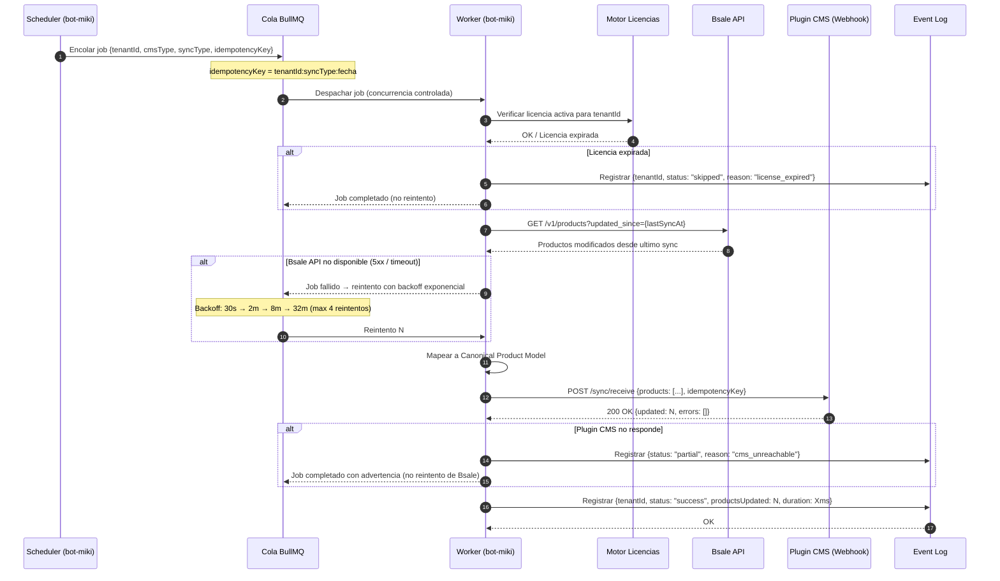

# Flujo: Sync Automatico

bot-miki ejecuta syncs programadas por tenant segun la configuracion de cada uno (ej: cada hora, cada noche, en tiempo real via webhook de Bsale). El comercio no necesita estar presente.



---

## Estrategia de Reintentos

| Intento | Delay | Condicion |
|---|---|---|
| 1 (original) | 0s | Siempre |
| 2 | 30s | Error 5xx o timeout de Bsale |
| 3 | 2 min | Error 5xx o timeout de Bsale |
| 4 | 8 min | Error 5xx o timeout de Bsale |
| 5 | 32 min | Error 5xx o timeout de Bsale |
| Dead Letter | — | Despues de 4 reintentos fallidos → alerta Slack |

**No se reintenta si:**
- Bsale devuelve 4xx (error del cliente — datos incorrectos, no temporal)
- La licencia del tenant esta expirada
- El job tiene la misma `idempotencyKey` que un job ya completado exitosamente en las ultimas 24h

---

## Configuracion por Tenant

Cada tenant puede configurar en el dashboard:

```json
{
  "tenantId": "acme-store",
  "schedule": {
    "products": "0 * * * *",
    "prices":   "*/30 * * * *",
    "stock":    "*/15 * * * *",
    "clients":  "0 2 * * *",
    "orders":   "*/5 * * * *"
  },
  "syncEntities": ["products", "prices", "stock"],
  "bsaleIntegrationId": 42
}
```

Los schedules son expresiones cron ejecutadas por el Scheduler de bot-miki. Cada entidad puede tener frecuencia independiente.
