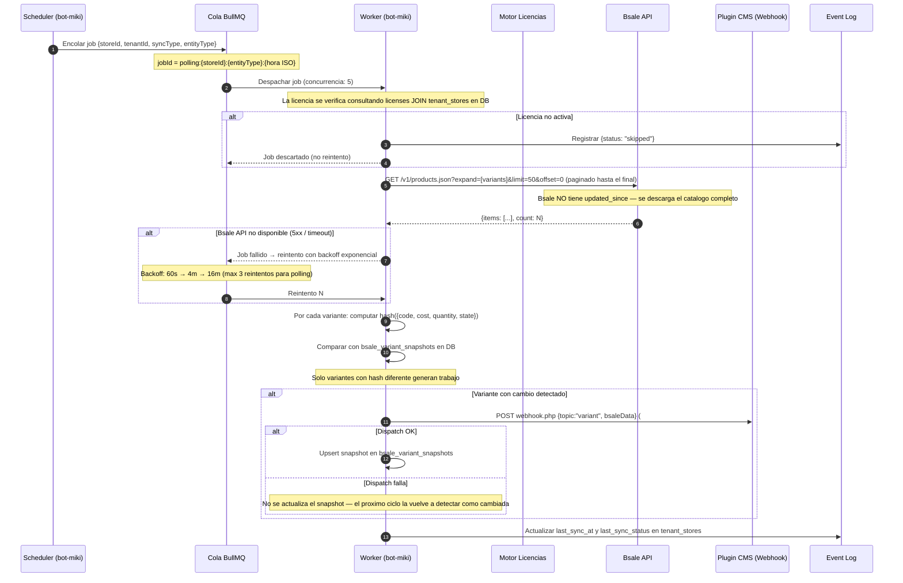

# Flujo: Sync Automatico

bot-miki ejecuta syncs programadas por tenant segun la configuracion de cada uno (ej: cada hora, cada noche, en tiempo real via webhook de Bsale). El comercio no necesita estar presente.



---

## Estrategia de Reintentos

**Jobs de polling (scheduler):**

| Intento | Delay | Condicion |
|---|---|---|
| 1 (original) | 0s | Siempre |
| 2 | 60s | Error 5xx o timeout de Bsale |
| 3 | 4 min | Error 5xx o timeout de Bsale |
| Dead Letter | — | Despues de 3 intentos fallidos → registro en sync_events |

**Jobs de webhook:**

| Intento | Delay | Condicion |
|---|---|---|
| 1 (original) | 0s | Siempre |
| 2-5 | 30s → 2m → 8m → 32m | Error 5xx o timeout de Bsale |
| Dead Letter | — | Despues de 5 intentos fallidos → registro en sync_events |

**No se reintenta si:**
- Bsale devuelve 4xx (error del cliente — datos incorrectos, no temporal) → `job.discard()`
- El store no tiene `bsale_access_token` configurado → `job.discard()`
- El job tiene el mismo `jobId` que uno ya completado dentro del `removeOnComplete.age` (24h)

---

## Configuracion por Tenant

Cada tenant puede configurar en el dashboard:

```json
{
  "tenantId": "acme-store",
  "schedule": {
    "products": "0 * * * *",
    "prices":   "*/30 * * * *",
    "stock":    "*/15 * * * *",
    "clients":  "0 2 * * *",
    "orders":   "*/5 * * * *"
  },
  "syncEntities": ["products", "prices", "stock"],
  "bsaleIntegrationId": 42
}
```

Los schedules son expresiones cron ejecutadas por el Scheduler de bot-miki. Cada entidad puede tener frecuencia independiente.
