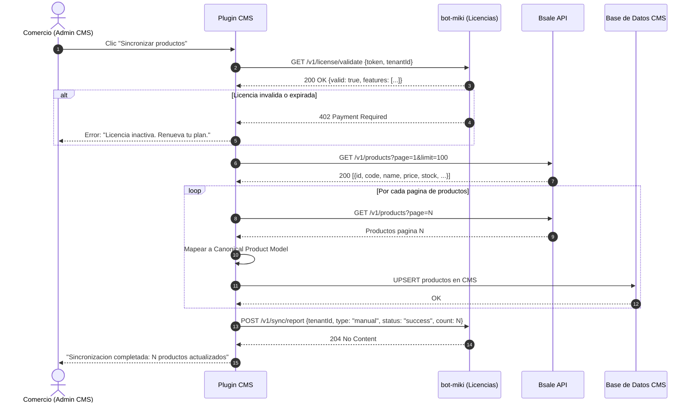

# Flujo: Sync Manual

El comercio dispara la sincronizacion desde el panel de administracion de su CMS. No requiere que bot-miki este activo — el plugin CMS se comunica directamente con Bsale API.

---

## Consideraciones de Implementacion

**Paginacion obligatoria:** Bsale pagina sus respuestas. El plugin debe manejar `total_pages` y nunca asumir que una sola llamada trae todos los productos.

**UPSERT por codigo de producto:** La clave de sincronizacion es `product.code` (SKU en Bsale), no el ID interno del CMS. Esto garantiza que un producto eliminado y recreado en Bsale se actualiza en lugar de duplicarse.

**Validacion de licencia con cache:** El plugin debe cachear el resultado de `/v1/license/validate` por 5 minutos para no bloquear cada operacion en la red al demonio. El cache es un JWT firmado con TTL.

**Reporte de sync:** El `POST /v1/sync/report` es fire-and-forget. Si falla, el plugin no debe interrumpir la operacion — el event log es informacional, no critico para el sync.

**Tiempo de ejecucion PHP:** Los plugins WordPress/PrestaShop/Magento corren bajo Apache con `max_execution_time` tipicamente de 30-300s. Para catalogos grandes (>5000 productos), el sync manual debe ejecutarse via `wp-cron` o un proceso de background PHP, no en el request HTTP del admin.
