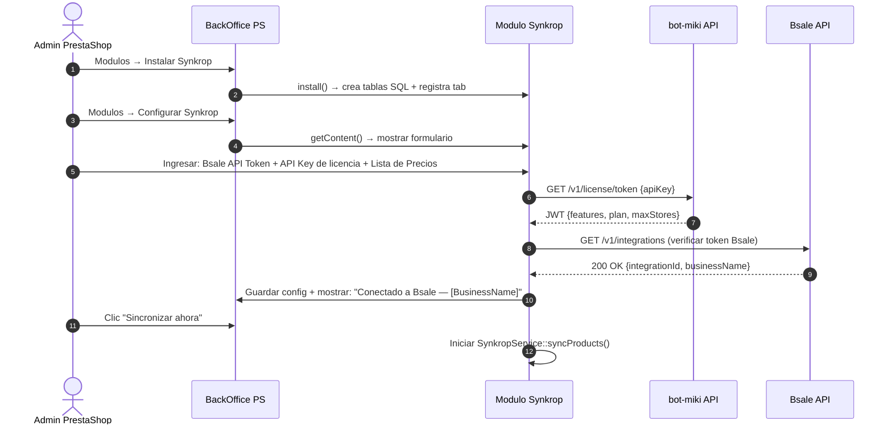

# Diseño del Plugin PrestaShop (cms-prestashop)

PrestaShop es el primer CMS a implementar. Es un modulo PHP que se instala desde el panel de administracion del comercio.

---

## Estructura del Modulo

```
packages/cms-prestashop/
├── synkrop/                          ← nombre del modulo (carpeta = nombre en PS)
│   ├── synkrop.php                   ← clase principal del modulo (obligatoria)
│   ├── config.xml                      ← metadata del modulo (generado)
│   ├── logo.png                        ← icono 32×32 que aparece en el backoffice
│   │
│   ├── controllers/
│   │   └── admin/
│   │       └── AdminSynkropController.php   ← pantalla de configuracion en backoffice
│   │
│   ├── views/
│   │   └── templates/
│   │       └── admin/
│   │           ├── configure.tpl       ← formulario de configuracion (Smarty)
│   │           └── sync-status.tpl    ← tabla de estado de ultimo sync
│   │
│   ├── classes/
│   │   ├── BsaleApiClient.php          ← HTTP client para Bsale API
│   │   ├── SynkropService.php        ← orquesta el flujo de sync
│   │   ├── CanonicalProduct.php        ← modelo canonico (PHP)
│   │   ├── BsaleProductAdapter.php     ← Bsale response → CanonicalProduct
│   │   ├── PrestashopProductAdapter.php← CanonicalProduct → PrestaShop Product
│   │   ├── LicenseClient.php           ← valida licencia contra bot-miki API
│   │   └── SyncReporter.php           ← reporta resultado a bot-miki
│   │
│   ├── sql/
│   │   ├── install.sql                 ← tablas propias del modulo
│   │   └── uninstall.sql
│   │
│   └── translations/
│       ├── es.php
│       └── en.php
│
├── tests/
│   ├── unit/
│   │   ├── BsaleProductAdapterTest.php
│   │   └── PrestashopProductAdapterTest.php
│   └── integration/
│       └── SyncServiceTest.php
│
└── composer.json
```

---

## Clase Principal del Modulo

```php
<?php
// packages/cms-prestashop/synkrop/synkrop.php

if (!defined('_PS_VERSION_')) {
    exit;
}

class Synkrop extends Module
{
    public function __construct()
    {
        $this->name          = 'synkrop';
        $this->tab           = 'administration';
        $this->version       = '1.0.0';
        $this->author        = 'kpcrop-latam';
        $this->need_instance = 0;
        $this->ps_versions_compliancy = ['min' => '1.7', 'max' => _PS_VERSION_];
        $this->bootstrap     = true;

        parent::__construct();

        $this->displayName = $this->l('Synkrop');
        $this->description = $this->l('Sincroniza productos, precios y stock desde Bsale a tu tienda PrestaShop.');
    }

    public function install(): bool
    {
        return parent::install()
            && $this->registerHook('actionAdminControllerSetMedia')
            && $this->installTab()
            && $this->installDb();
    }

    public function uninstall(): bool
    {
        return parent::uninstall()
            && $this->uninstallTab()
            && $this->uninstallDb();
    }

    // Registrar tab en el menu de Administracion
    private function installTab(): bool
    {
        $tab = new Tab();
        $tab->active = 1;
        $tab->class_name = 'AdminSynkrop';
        $tab->name = [];
        foreach (Language::getLanguages(true) as $lang) {
            $tab->name[$lang['id_lang']] = 'Synkrop';
        }
        $tab->id_parent = (int) Tab::getIdFromClassName('AdminCatalog');
        $tab->module = $this->name;
        return $tab->add();
    }

    private function installDb(): bool
    {
        $sql = file_get_contents(__DIR__ . '/sql/install.sql');
        return Db::getInstance()->execute($sql);
    }

    private function uninstallDb(): bool
    {
        $sql = file_get_contents(__DIR__ . '/sql/uninstall.sql');
        return Db::getInstance()->execute($sql);
    }
}
```

---

## Canonical Product Model en PHP

```php
<?php
// packages/cms-prestashop/synkrop/classes/CanonicalProduct.php

class CanonicalProduct
{
    public int    $bsaleId;
    public string $code;          // SKU — clave de idempotencia
    public string $name;
    public ?string $description;
    public string $status;        // 'active' | 'inactive'

    public float  $priceNet;      // Sin IVA
    public float  $priceGross;    // Con IVA — lo que paga el cliente
    public string $currency;      // 'CLP', 'USD', etc.
    public float  $taxRate;       // 0.19 para IVA Chile

    public int    $stockQuantity;
    public bool   $allowNegativeStock;

    public ?string $categoryName;
    public ?string $brand;

    /** @var CanonicalVariant[] */
    public array $variants = [];

    /** @var array<array{url: string, isPrimary: bool, order: int}> */
    public array $images = [];

    public DateTime $bsaleUpdatedAt;
}

class CanonicalVariant
{
    public int    $bsaleId;
    public string $code;
    public array  $attributes;    // ['color' => 'Rojo', 'talla' => 'M']
    public int    $stockQuantity;
    public ?string $barcode;
}
```

---

## Adapter Bsale → Canonical

```php
<?php
// packages/cms-prestashop/synkrop/classes/BsaleProductAdapter.php

class BsaleProductAdapter
{
    public function fromBsaleResponse(array $bsaleProduct): CanonicalProduct
    {
        $canonical = new CanonicalProduct();
        $canonical->bsaleId      = $bsaleProduct['id'];
        $canonical->code         = $bsaleProduct['code'];
        $canonical->name         = $bsaleProduct['name'];
        $canonical->description  = $bsaleProduct['description'] ?? null;
        $canonical->status       = $bsaleProduct['state'] === 0 ? 'active' : 'inactive';

        // Bsale devuelve precio neto; calcular bruto con IVA Chile (19%)
        $canonical->priceNet     = (float) $bsaleProduct['price'];
        $canonical->taxRate      = 0.19;
        $canonical->priceGross   = $canonical->priceNet * (1 + $canonical->taxRate);
        $canonical->currency     = 'CLP';

        $canonical->stockQuantity       = (int) ($bsaleProduct['stock'] ?? 0);
        $canonical->allowNegativeStock  = false;

        $canonical->bsaleUpdatedAt = new DateTime($bsaleProduct['href'] ?? 'now');

        // Imagenes
        foreach ($bsaleProduct['images']['items'] ?? [] as $i => $img) {
            $canonical->images[] = [
                'url'       => $img['urlImage'],
                'isPrimary' => $i === 0,
                'order'     => $i,
            ];
        }

        return $canonical;
    }
}
```

---

## Adapter Canonical → PrestaShop

```php
<?php
// packages/cms-prestashop/synkrop/classes/PrestashopProductAdapter.php

class PrestashopProductAdapter
{
    private int $defaultLangId;
    private int $defaultShopId;

    public function __construct(int $defaultLangId, int $defaultShopId)
    {
        $this->defaultLangId = $defaultLangId;
        $this->defaultShopId = $defaultShopId;
    }

    public function upsert(CanonicalProduct $canonical): Product
    {
        // Buscar producto existente por codigo (SKU = reference en PrestaShop)
        $product = $this->findByReference($canonical->code);

        if ($product === null) {
            $product = new Product();
        }

        $product->reference = $canonical->code;
        $product->name      = [$this->defaultLangId => $canonical->name];
        $product->description = [$this->defaultLangId => $canonical->description ?? ''];
        $product->price     = $canonical->priceNet;  // PrestaShop trabaja con precio neto
        $product->active    = $canonical->status === 'active' ? 1 : 0;

        // Tax rule para IVA Chile (debe existir en PrestaShop)
        $product->id_tax_rules_group = $this->getTaxRuleGroupForRate($canonical->taxRate);

        if ($product->id) {
            $product->update();
        } else {
            $product->add();
        }

        // Actualizar stock
        StockAvailable::setQuantity($product->id, 0, $canonical->stockQuantity);

        // Sincronizar imagenes (solo si cambiaron)
        $this->syncImages($product, $canonical->images);

        return $product;
    }

    private function findByReference(string $reference): ?Product
    {
        $id = Product::getIdByReference($reference);
        return $id ? new Product($id) : null;
    }

    private function getTaxRuleGroupForRate(float $rate): int
    {
        // IVA 19% Chile → buscar el grupo de impuesto configurado
        // Si no existe, usar el default de la tienda
        return (int) Configuration::get('SYNKROP_TAX_RULE_GROUP_ID') ?: 1;
    }

    private function syncImages(Product $product, array $images): void
    {
        foreach ($images as $imageData) {
            // Solo agregar si la URL no existe ya en el producto
            // para no duplicar imagenes en cada sync
            if (!$this->imageExists($product->id, $imageData['url'])) {
                $image = new Image();
                $image->id_product = $product->id;
                $image->cover      = $imageData['isPrimary'] ? 1 : 0;
                $image->add();
                // Descargar y guardar imagen en directorio de PS
                $this->downloadImage($imageData['url'], $image->id);
            }
        }
    }

    private function imageExists(int $productId, string $url): bool
    {
        // Buscar en tabla auxiliar synkrop_images si la URL ya fue importada
        return (bool) Db::getInstance()->getValue(
            'SELECT id FROM `' . _DB_PREFIX_ . 'synkrop_images`
             WHERE id_product = ' . (int) $productId . '
             AND source_url = "' . pSQL($url) . '"'
        );
    }

    private function downloadImage(string $url, int $imageId): void
    {
        $path = _PS_PROD_IMG_DIR_ . Image::getImgFolderStatic($imageId) . $imageId . '.jpg';
        file_put_contents($path, file_get_contents($url));
    }
}
```

---

## Esquema de Base de Datos del Modulo

```sql
-- packages/cms-prestashop/synkrop/sql/install.sql

-- Configuracion del modulo por tienda
CREATE TABLE IF NOT EXISTS `PREFIX_synkrop_config` (
    `id`                    INT UNSIGNED NOT NULL AUTO_INCREMENT,
    `id_shop`               INT UNSIGNED NOT NULL DEFAULT 1,
    `bsale_api_token`       VARCHAR(255) NOT NULL DEFAULT '',
    `bsale_integration_id`  INT UNSIGNED,
    `bsale_price_list_id`   INT UNSIGNED,
    `daemon_api_url`        VARCHAR(500) NOT NULL DEFAULT 'https://api.kpcrop.com/v1',
    `daemon_api_key`        VARCHAR(64)  NOT NULL DEFAULT '',
    `license_jwt`           TEXT,
    `license_jwt_expires`   DATETIME,
    `last_sync_at`          DATETIME,
    `last_sync_status`      VARCHAR(20),
    `last_sync_count`       INT DEFAULT 0,
    PRIMARY KEY (`id`),
    UNIQUE KEY `shop` (`id_shop`)
) ENGINE=InnoDB DEFAULT CHARSET=utf8mb4;

-- Registro de imagenes importadas para evitar duplicados
CREATE TABLE IF NOT EXISTS `PREFIX_synkrop_images` (
    `id`            INT UNSIGNED NOT NULL AUTO_INCREMENT,
    `id_product`    INT UNSIGNED NOT NULL,
    `id_image`      INT UNSIGNED NOT NULL,
    `source_url`    VARCHAR(1000) NOT NULL,
    `imported_at`   DATETIME NOT NULL DEFAULT CURRENT_TIMESTAMP,
    PRIMARY KEY (`id`),
    KEY `product` (`id_product`)
) ENGINE=InnoDB DEFAULT CHARSET=utf8mb4;

-- Log de syncs para mostrar historial en backoffice
CREATE TABLE IF NOT EXISTS `PREFIX_synkrop_log` (
    `id`            INT UNSIGNED NOT NULL AUTO_INCREMENT,
    `id_shop`       INT UNSIGNED NOT NULL DEFAULT 1,
    `sync_type`     VARCHAR(20) NOT NULL DEFAULT 'manual',
    `entity_type`   VARCHAR(20) NOT NULL DEFAULT 'products',
    `status`        VARCHAR(20) NOT NULL,
    `records`       INT DEFAULT 0,
    `duration_ms`   INT DEFAULT 0,
    `error_msg`     TEXT,
    `created_at`    DATETIME NOT NULL DEFAULT CURRENT_TIMESTAMP,
    PRIMARY KEY (`id`),
    KEY `shop_date` (`id_shop`, `created_at`)
) ENGINE=InnoDB DEFAULT CHARSET=utf8mb4;
```

---

## Flujo de Configuracion Inicial (Admin PrestaShop)



---

## Hooks de PrestaShop Utilizados

| Hook | Cuando se dispara | Uso en el modulo |
|---|---|---|
| `actionAdminControllerSetMedia` | Al cargar cualquier pagina del backoffice | Agregar JS/CSS del modulo |
| No se usan hooks de front | — | El modulo es 100% backoffice y CLI |

El modulo **no usa hooks de front-end** — no altera la visualizacion de la tienda. Solo sincroniza datos via el BackOffice y opcionalmente via comando CLI de PrestaShop para syncs programadas (sin depender de `wp-cron` o similares).

---

## Sync Programado sin Demonio (MVP)

Para el MVP, antes de que bot-miki este operativo, el sync automatico se puede implementar via **cron del servidor** del cliente llamando al script CLI de PrestaShop:

```bash
# En el servidor del cliente (crontab)
# Sync de productos cada hora
0 * * * * php /var/www/prestashop/modules/synkrop/cli/sync.php products

# Sync de stock cada 15 minutos
*/15 * * * * php /var/www/prestashop/modules/synkrop/cli/sync.php stock
```

```php
<?php
// packages/cms-prestashop/synkrop/cli/sync.php
// Permite ejecutar sync desde cron sin pasar por HTTP (sin limite de tiempo PHP)

define('_PS_ADMIN_DIR_', __DIR__ . '/../../../admin');
require_once __DIR__ . '/../../../config/config.inc.php';

$entityType = $argv[1] ?? 'products';
$service = new SynkropService();
$service->sync($entityType);
```

Cuando bot-miki este operativo, este cron del cliente se reemplaza por el scheduler del demonio que envia webhooks al modulo — sin que el cliente tenga que configurar nada en su servidor.
