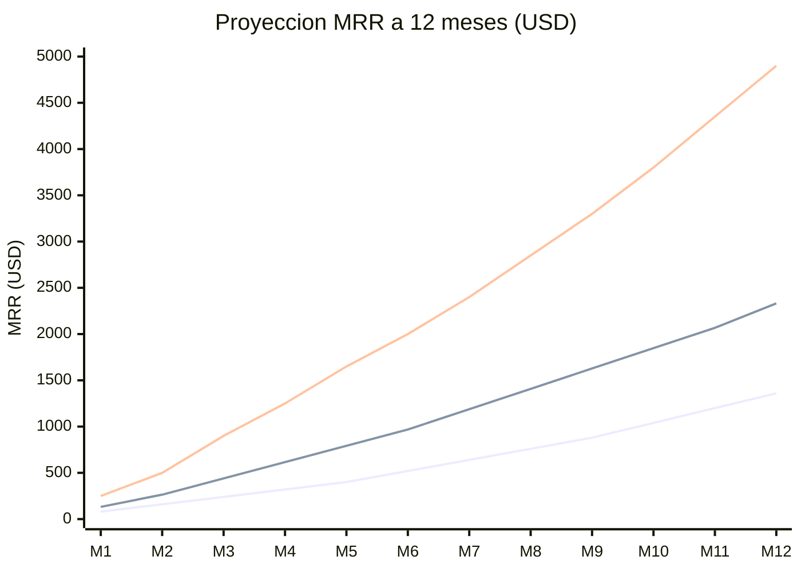

# Plan Financiero — kpcrop-latam-zollner-platform

**Fecha:** 2026-05-22
**Version:** 1.0
**Tipo de cambio de referencia:** 1 USD = 950 CLP

---

## Introduccion

Este documento consolida la informacion financiera del proyecto: inversion inicial, costos operativos, estructura de ingresos, punto de equilibrio y proyecciones a 3 anos. El modelo de negocio es SaaS de suscripcion mensual con tres tiers de precio.

El modelo SaaS tiene una ventaja estructural importante para un equipo pequeno: los costos fijos son extremadamente bajos (~USD 80/mes al inicio), lo que implica que el punto de equilibrio se alcanza con apenas 2 clientes pagantes. Esto reduce drasticamente el riesgo financiero del proyecto en comparacion con modelos de producto fisico o de servicios de alto costo fijo.

---

## 1. Inversion Inicial

La inversion inicial es el capital requerido para lanzar el producto hasta tener los primeros clientes pagantes. En este caso, el equipo ya tiene el stack tecnologico disponible, por lo que la inversion es minima.

| Concepto | Monto (USD) | Monto (CLP) | Observacion |
|---|---|---|---|
| Registro de marca en INAPI (nombre "kpcrop") | USD 315 | CLP 300.000 | Estimado. Confirmar tarifa vigente en INAPI |
| Buffer operativo — 3 meses de costos fijos | USD 240 | CLP 228.000 | Cubre Railway + dominio + SSL por 3 meses |
| Herramientas de desarrollo | USD 0 | CLP 0 | Ya disponibles en el equipo |
| Dominio web (registro anual) | USD 15 | CLP 14.250 | .com o .cl — costo primer ano |
| Registro en marketplace de Bsale | USD 0 | CLP 0 | A confirmar — probable sin costo |
| Diseno de landing page (equipo propio) | USD 0 | CLP 0 | El disenador es parte del equipo |
| **Total inversion inicial** | **USD 570** | **CLP 541.500** | |

**Nota:** El costo mas significativo de este proyecto es el tiempo del equipo, que ya esta siendo invertido. El costo de oportunidad no esta incluido como inversion monetaria porque el equipo ha decidido asumir ese riesgo.

---

## 2. Fuentes de Financiamiento

| Fuente | Monto (USD) | Detalle |
|---|---|---|
| Autofinanciamiento — fondos propios del fundador | USD 570 | Cubre la inversion inicial completa |
| Tiempo propio del programador (costo de oportunidad) | No monetizado | Equivalente a 3-6 meses de desarrollo part-time |
| Tiempo propio del disenador | No monetizado | Landing page, assets de marketing |
| Fondos SERCOTEC/CORFO (opcional — fase 2) | Por postular | Fondos de transformacion digital para PYMEs tecnologicas |

**Conclusion:** El proyecto no requiere financiamiento externo para la fase de lanzamiento. El modelo bootstrapped es viable dado el bajo costo fijo. Si se requiere acelerar el crecimiento post mes 6, se puede postular a fondos publicos o explorar capital angel.

---

## 3. Costos Fijos Mensuales

Estos costos se incurren independientemente del numero de clientes activos.

| Concepto | USD/mes | CLP/mes | Observacion |
|---|---|---|---|
| Railway — hosting bot-miki (Node.js + PostgreSQL + Redis) | USD 25 | CLP 23.750 | Tier basico. Escala a USD 50-100 con mas carga |
| Dominio y SSL | USD 5 | CLP 4.750 | Promedio mensual del costo anual |
| Herramientas de desarrollo (VS Code, GitHub, etc.) | USD 0 | CLP 0 | Ya incluidas en el equipo |
| Email transaccional (Resend o similar) | USD 5 | CLP 4.750 | Para notificaciones de sync y alertas |
| Monitoreo y alertas (BetterStack o similar) | USD 10 | CLP 9.500 | Uptime monitoring — critico para SaaS |
| Stripe — cuota fija | USD 0 | CLP 0 | Sin cuota fija — solo comision por transaccion |
| MercadoPago — cuota fija | USD 0 | CLP 0 | Sin cuota fija — solo comision por transaccion |
| **Total costos fijos** | **USD 45-80** | **CLP 42.750 - 76.000** | Rango segun uso de Railway |

**Nota conservadora:** Se usa USD 80/mes como costo fijo base para los calculos de punto de equilibrio.

---

## 4. Costos Variables (por Cliente Adicional)

| Concepto | USD/tenant/mes | Observacion |
|---|---|---|
| Railway — CPU y RAM adicional | USD 0.50 | Estimado. Railway escala verticalmente; cada tenant adicional tiene consumo marginal bajo |
| Costos de procesamiento de pagos (Stripe) | 2.9% + USD 0.30 por transaccion | Para un pago mensual de USD 49: ~USD 1.72 en fees |
| Costos de procesamiento de pagos (MercadoPago) | 3.49% por transaccion | Para un pago mensual de USD 49 en CLP: ~CLP 1.622 en fees |
| Soporte (tiempo del fundador) | Variable | Objetivo: < 15 min por ticket; meta de self-service > 80% de casos |

**Margen bruto estimado por cliente Growth (USD 49/mes):**

| Concepto | Monto |
|---|---|
| Ingreso por suscripcion | USD 49.00 |
| (-) Railway variable | USD 0.50 |
| (-) Stripe fees (si paga en USD) | USD 1.72 |
| **Margen bruto por cliente** | **USD 46.78** |
| **Margen bruto %** | **95.5%** |

El margen bruto superior al 90% es caracteristico del modelo SaaS con costos de infraestructura bajos. Este margen permite reinvertir en marketing y soporte sin comprometer la viabilidad financiera.

---

## 5. Estructura de Ingresos por Tier

| Plan | USD/mes | CLP/mes | USD/ano | CLP/ano | Limite productos | Tiendas |
|---|---|---|---|---|---|---|
| Starter | USD 19 | CLP 18.050 | USD 228 | CLP 216.600 | 1.000 | 1 |
| Growth | USD 49 | CLP 46.550 | USD 588 | CLP 558.600 | 10.000 | 3 |
| Agency | USD 120 | CLP 114.000 | USD 1.440 | CLP 1.368.000 | Ilimitado | Ilimitado |

**Precio promedio ponderado estimado (mix de tiers asumido para calculo de equilibrio):**

Asumiendo que la mayoria de los clientes iniciales entran en Growth o Starter, y con escasa presencia del tier Agency:

| Tier | % del mix asumido | USD/mes | Contribucion al promedio |
|---|---|---|---|
| Starter | 40% | USD 19 | USD 7.60 |
| Growth | 50% | USD 49 | USD 24.50 |
| Agency | 10% | USD 120 | USD 12.00 |
| **ARPU ponderado** | **100%** | | **USD 44.10** |

---

## 6. Punto de Equilibrio

El punto de equilibrio (break-even) es el numero de clientes activos necesarios para que los ingresos cubran exactamente los costos fijos mensuales.

**Formula:**

```
Punto de Equilibrio = Costos Fijos Mensuales / ARPU Promedio Ponderado

Punto de Equilibrio = USD 80 / USD 44.10 = 1.81 → 2 clientes
```

**Conclusion:** Con solo 2 clientes activos pagando un precio promedio de USD 44/mes, el negocio cubre sus costos fijos. Esto es una ventaja competitiva critica del modelo SaaS: el riesgo de "no llegar al break-even" es practicamente inexistente si se logra convertir el primer trial en cliente pagante.

**Tabla de rentabilidad por numero de clientes:**

| Clientes activos | MRR (USD) | Costos fijos (USD) | Resultado mensual (USD) | Resultado (CLP) |
|---|---|---|---|---|
| 1 | USD 44 | USD 80 | -USD 36 | -CLP 34.200 |
| 2 | USD 88 | USD 80 | +USD 8 | +CLP 7.600 |
| 5 | USD 221 | USD 80 | +USD 141 | +CLP 133.950 |
| 10 | USD 441 | USD 82 | +USD 359 | +CLP 341.050 |
| 25 | USD 1.103 | USD 92 | +USD 1.011 | +CLP 960.450 |
| 50 | USD 2.205 | USD 105 | +USD 2.100 | +CLP 1.995.000 |

*Los costos fijos aumentan ligeramente al escalar porque Railway incrementa con mas carga de trabajo.*

---

## 7. Proyeccion de Ventas a 3 Anos

La proyeccion asume que el canal del marketplace de Bsale es aprobado en el mes 3 del lanzamiento, y que el crecimiento organico se acelera a partir de ese punto.

### Escenarios

**Supuestos comunes a todos los escenarios:**
- Trial de 14 dias sin tarjeta
- Conversion trial-a-pago: 25% (conservador), 35% (base), 50% (optimista)
- Churn mensual: 5% (conservador), 3.5% (base), 2% (optimista)
- ARPU: USD 40 (conservador), USD 44 (base), USD 50 (optimista)

### Ano 1 — Proyeccion Mensual

| Mes | Clientes (Conservador) | MRR (Conservador) | Clientes (Base) | MRR (Base) | Clientes (Optimista) | MRR (Optimista) |
|---|---|---|---|---|---|---|
| 1 | 2 | USD 80 | 3 | USD 132 | 5 | USD 250 |
| 2 | 4 | USD 160 | 6 | USD 264 | 10 | USD 500 |
| 3 | 6 | USD 240 | 10 | USD 440 | 18 | USD 900 |
| 4 | 8 | USD 320 | 14 | USD 616 | 25 | USD 1.250 |
| 5 | 10 | USD 400 | 18 | USD 792 | 33 | USD 1.650 |
| 6 | 13 | USD 520 | 22 | USD 968 | 40 | USD 2.000 |
| 7 | 16 | USD 640 | 27 | USD 1.188 | 48 | USD 2.400 |
| 8 | 19 | USD 760 | 32 | USD 1.408 | 57 | USD 2.850 |
| 9 | 22 | USD 880 | 37 | USD 1.628 | 66 | USD 3.300 |
| 10 | 26 | USD 1.040 | 42 | USD 1.848 | 76 | USD 3.800 |
| 11 | 30 | USD 1.200 | 47 | USD 2.068 | 87 | USD 4.350 |
| 12 | 34 | USD 1.360 | 53 | USD 2.332 | 98 | USD 4.900 |

### Resumen por Ano (ARR)

| Periodo | Escenario Conservador | Escenario Base | Escenario Optimista |
|---|---|---|---|
| Fin Ano 1 — Clientes | 34 | 53 | 98 |
| Fin Ano 1 — MRR | USD 1.360 | USD 2.332 | USD 4.900 |
| Fin Ano 1 — ARR | USD 16.320 | USD 27.984 | USD 58.800 |
| Fin Ano 2 — Clientes | 80 | 140 | 250 |
| Fin Ano 2 — MRR | USD 3.200 | USD 6.160 | USD 12.500 |
| Fin Ano 2 — ARR | USD 38.400 | USD 73.920 | USD 150.000 |
| Fin Ano 3 — Clientes | 180 | 350 | 600 |
| Fin Ano 3 — MRR | USD 7.200 | USD 15.400 | USD 30.000 |
| Fin Ano 3 — ARR | USD 86.400 | USD 184.800 | USD 360.000 |



*Lineas: Conservador / Base / Optimista*

---

## 8. Control de Ganancias — Semaforo Mensual

La siguiente tabla debe completarse mensualmente para hacer seguimiento del desempeno financiero real vs. proyectado.

### Criterios del Semaforo

| Metrica | Verde (Optimo) | Amarillo (Tolerable) | Rojo (Deficiente) |
|---|---|---|---|
| MRR mensual | >= proyeccion base | Entre conservador y base | Por debajo del conservador |
| Clientes nuevos/mes | >= 5 | 2-4 | < 2 |
| Churn mensual | < 3% | 3-5% | > 5% |
| Costos fijos | <= USD 80 | USD 80-120 | > USD 120 |
| Resultado mensual | Positivo | Neutro (+/- 10%) | Negativo |

### Tabla de Seguimiento Mensual

| Mes | MRR Real (USD) | Clientes Activos | Nuevos | Churned | Costos (USD) | Resultado (USD) | Semaforo |
|---|---|---|---|---|---|---|---|
| Mes 1 | | | | | | | |
| Mes 2 | | | | | | | |
| Mes 3 | | | | | | | |
| Mes 4 | | | | | | | |
| Mes 5 | | | | | | | |
| Mes 6 | | | | | | | |
| Mes 7 | | | | | | | |
| Mes 8 | | | | | | | |
| Mes 9 | | | | | | | |
| Mes 10 | | | | | | | |
| Mes 11 | | | | | | | |
| Mes 12 | | | | | | | |

**Instruccion de uso:** Completar la tabla el primer dia de cada mes con los datos del mes anterior. Si el semaforo es Rojo dos meses consecutivos, revisar urgentemente la estrategia de adquisicion o el churn. Si es Rojo tres meses consecutivos, evaluar pivote o suspension del proyecto.

---

## Preguntas Pendientes de Validar

1. **Tarifa Railway a escala:** El costo estimado de USD 0.50 por tenant adicional en Railway es una estimacion no validada. Se recomienda hacer un test de carga con 50 tenants simulados en un entorno de staging para confirmar el costo real antes del mes 6.

2. **Conversion trial-a-pago real:** La tasa de 25% en el escenario conservador es una hipotesis. El primer dato real se tendra despues de los primeros 20 trials. Si la conversion es menor al 15%, revisar el onboarding y el value delivery en los primeros 3 dias del trial.

3. **Aceptacion de MercadoPago vs. Stripe:** Para clientes en Chile, MercadoPago tiene mejor adoption rate pero comisiones mas altas (3.49% vs. 2.9%). Validar con los primeros 10 clientes cual prefieren para optimizar el mix de gateways y reducir los costos de procesamiento.
