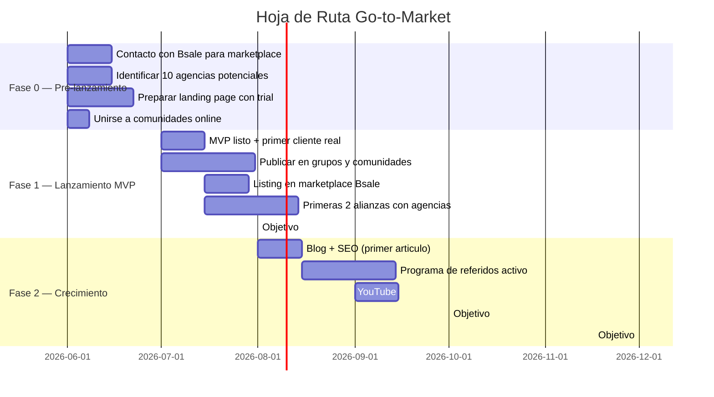
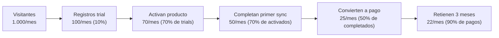

# Plan Go-to-Market — kpcrop-latam-zollner-platform

**Fecha:** 2026-05-29
**Mercado primario:** Chile → Agencias digitales / Expansión Perú
**Horizonte:** 12 meses desde el lanzamiento del MVP
**Version:** 2.0 — Pivot a canal agencias

> **Cambio v2.0:** El canal de agencias pasa a ser canal 1. El objetivo es cerrar 3 agencias en 90 días (no 15 comerciantes individuales). El éxito de 3 agencias con 10 clientes cada una = 30 clientes activos sin trabajo de ventas adicional. La métrica principal cambia de "clientes individuales" a "agencias cerradas".

---

## Resumen Ejecutivo

El plan GTM de los primeros 12 meses tiene un unico objetivo: llegar a 50 clientes de pago y USD 1.500 de MRR. Es un objetivo validador, no un objetivo de escala. Con esos numeros el producto esta validado como negocio viable y justifica inversion adicional.

El plan se divide en tres fases:
- **Fase 0 (Pre-lanzamiento):** Posicionamiento, canal en Bsale, alianzas iniciales
- **Fase 1 (Meses 1-3):** Lanzamiento MVP, primeros 10 clientes de pago
- **Fase 2 (Meses 4-12):** Crecimiento organico y primer upsell sistematico

El presupuesto de marketing es practicamente cero en los primeros 3 meses — el crecimiento depende de canales gratuitos (marketplace de Bsale, grupos, referidos) y del esfuerzo personal del fundador.

---

## 1. Posicionamiento y Mensajes Clave

### 1.1 Posicionamiento Central

kpcrop-latam-zollner-platform se posiciona como el conector nativo entre Bsale y las tiendas online de las PYMEs chilenas. No es una herramienta de automatizacion generica — es el puente especifico para Bsale, construido por alguien que conoce profundamente el modelo de datos de Bsale.

**Tagline sugerido:**
> "Tu catalogo Bsale, siempre actualizado en tu tienda online."

### 1.2 Mensajes por Segmento

| Segmento | Mensaje principal | Prueba de valor |
|---|---|---|
| Comercio individual (Rodrigo, Catalina) | "Nunca mas actualices precios y stock en dos sistemas." | "Instala en 10 minutos, conecta tu Bsale, y tu tienda online se actualiza sola." |
| PYME mediana (Valeria) | "Elimina el proceso manual que te cuesta horas cada semana." | "Soporta hasta 10.000 SKUs. Sync automatico cada 15 minutos." |
| Agencias (Sebastian) | "Gestiona todos tus clientes con Bsale desde un solo lugar." | "Un plan Agency cubre clientes ilimitados. Haz markup sobre el precio." |

### 1.3 Mensaje de Diferenciacion

**Frente a integraciones nativas de Bsale:** "La integracion nativa de Bsale es basica y no cubre todos los CMS. Esta plataforma sincroniza PrestaShop, WooCommerce, Shopify, Magento y Jumpseller, con soporte a variantes, listas de precios y multiples sucursales."

**Frente a agencias a medida:** "Una agencia cobra USD 2.000-5.000 por hacer esto una vez y luego te cobra mas cuando algo cambia. Esta solucion cuesta USD 19/mes y se mantiene sola."

**Frente a Zapier:** "Zapier no tiene conector nativo para Bsale y requiere configuracion tecnica compleja. Esta plataforma esta construida especificamente para Bsale — instalas el plugin y funciona."

---

## 2. Canales de Adquisicion y Tacticas

### 2.1 Canal Prioritario 1 — Outreach Directo a Agencias (NUEVO)

**Por qué:** Una agencia ya tiene relación con 10-50 comerciantes con Bsale. Un solo contrato de agencia = acceso inmediato a esos clientes sin CAC adicional. Las agencias hoy refieren a Sidekick/Codificando y pierden la relación con su propio cliente — kpcrop white-label resuelve ese dolor directamente.

**Tácticas:**
1. Mapear 20 agencias chilenas que implementan PrestaShop/WooCommerce (búsqueda Google: "agencia PrestaShop Chile", "implementación WooCommerce Chile", LinkedIn)
2. Outreach secuencial: primer email de presentación → seguimiento a los 3 días → llamada de 20 minutos
3. Propuesta de valor para la agencia: "Ofrece sincronización Bsale a tus clientes como servicio tuyo, sin infraestructura. Tu logo, tu precio, tu relación con el cliente."
4. Primera agencia: acceso gratuito 60 días a cambio de feedback + testimonio
5. Foco en agencias con 5+ clientes activos con Bsale — calificar antes de invertir tiempo

**Mensaje para la agencia:**
> "Hoy cuando un cliente tuyo con Bsale te pregunta por la sincronización, los derivas a Sidekick o Codificando. Ellos pasan a ser los proveedores del cliente — tú pierdes la relación. Con kpcrop puedes ofrecer exactamente lo mismo con tu marca."

**Métrica de éxito:** 3 agencias cerradas en los primeros 90 días.

### 2.2 Canal Prioritario 2 — Expansión Perú

**Por qué:** Bsale tiene 2.700+ clientes en Perú. No hay competidores equivalentes a Sidekick/Pixofia/Codificando. Las agencias peruanas de WooCommerce/PrestaShop tienen el mismo dolor que las chilenas, sin solución. Contactar a Bsale Perú para listing como integrador certificado — en Perú probablemente somos los únicos en pedirlo.

**Tácticas:**
1. Investigar el mercado de agencias digitales en Perú (Google, LinkedIn, grupos)
2. Contactar equipo comercial de Bsale Perú directamente para listing
3. Identificar 5 agencias peruanas de PrestaShop/WooCommerce como primer pipeline
4. Misma propuesta de valor white-label — adaptar materiales al mercado peruano

**Timeline:** Iniciar en mes 4-5, una vez validado el modelo en Chile con 2+ agencias activas.

**Métrica de éxito:** Listing en Bsale Perú + 2 agencias peruanas en los primeros 6 meses de operación en Perú.

### 2.3 Canal Prioritario 3 — Marketplace de Bsale

**Por que:** Trafico pre-calificado. Los usuarios ya tienen Bsale, ya buscan integraciones, ya tienen willingness to pay.

**Tactica:**
1. Contactar a Bsale (ayuda@bsale.app o por el canal comercial) para solicitar listing en su marketplace
2. Preparar la ficha del producto: descripcion, capturas de pantalla, video de instalacion de 2 minutos
3. Publicar el listing tan pronto como el MVP este en estado "funciona con datos reales"

**Riesgo:** Bsale podria rechazar el listing, pedir revenue share, o tomar meses en aprobarlo. No depender exclusivamente de este canal.

**Metrica de exito:** 5 clientes en los primeros 3 meses provenientes de este canal.

### 2.4 Canal — Comunidades Online

**Por que:** Las PYMEs chilenas con e-commerce son activas en grupos de Facebook, Telegram y WhatsApp. El boca a boca en estas comunidades es el canal de mayor conversion para herramientas de este tipo.

**Tacticas:**
- Unirse a grupos de Facebook: "Emprendedores Chile", "PrestaShop Chile", "WooCommerce Chile", grupos sectoriales de ropa, gastronomia, insumos
- Publicar contenido de valor (no spam): "Como conecte Bsale con mi PrestaShop sin programar", tutoriales, casos de uso
- Responder preguntas sobre sincronizacion de Bsale con mencion del producto cuando es pertinente
- Compartir el link del trial en respuestas directas a personas que describen el problema

**Frecuencia:** 3-5 posts o comentarios utiles por semana (el fundador).

**Metrica de exito:** 3 clientes en los primeros 3 meses provenientes de este canal.

### 2.3 Canal Secundario — Alianzas con Agencias

**Por que:** Una sola agencia con 10 clientes Bsale puede ser equivalente a 10 ventas directas. El canal de agencias multiplica sin incrementar el trabajo de ventas del fundador.

**Tacticas:**
1. Identificar las 10-15 agencias principales que implementan PrestaShop y WooCommerce en Chile (busqueda en Google: "agencia PrestaShop Chile", "implementacion WooCommerce Chile")
2. Contacto directo por LinkedIn o email con propuesta de partnership
3. Propuesta inicial: "Ofrece esto a tus clientes con Bsale, te damos 20% del primer mes de cada cliente que nos refieran"
4. Para las agencias interesadas: ofrecerles acceso a una cuenta Agency gratis por 60 dias para que lo prueben con sus propios clientes

**Metrica de exito:** 2 agencias aliadas activas en los primeros 6 meses, generando al menos 5 clientes combinados.

### 2.4 Canal de Largo Plazo — SEO y Contenido

**Por que:** Las busquedas como "conectar Bsale con PrestaShop", "sincronizar Bsale WooCommerce", "integracion Bsale Shopify" tienen intento de compra alto y competencia baja hoy.

**Tacticas:**
- Blog o seccion de documentacion publica con articulos tecnico-practicos
- Video de YouTube: instalacion paso a paso de cada CMS
- Articulos guia: "Como conectar Bsale con PrestaShop en 2026" (con SEO para cada CMS)

**Timeline:** Comenzar en el mes 3, ver primeros resultados en el mes 6-9.

**Metrica de exito:** 500 visitantes organicos mensuales al mes 12.

### 2.5 Canal Pagado — Post-MVP

**Cuando activarlo:** Solo cuando el CAC del canal organico supere el LTV de los primeros clientes, o cuando el MRR supere USD 2.000 (para que la inversion en ads sea recuperable).

**Canales candidatos:**
- Google Ads: keywords de intencion alta ("integracion Bsale CMS", "sincronizar Bsale tienda online")
- Presupuesto sugerido al iniciar: USD 200-300/mes
- Facebook Ads: reorientacion de visitantes del sitio web (retargeting)

---

## 3. Estrategia de Lanzamiento MVP

### 3.1 Condiciones de Lanzamiento

El MVP esta listo para lanzar cuando:

1. Un comercio puede instalar el plugin de PrestaShop desde cero sin soporte tecnico en menos de 10 minutos
2. El sync manual sincroniza correctamente productos, precios y stock con Bsale en al menos 3 cuentas de prueba reales
3. El billing con Stripe esta activo (puede recibir pagos reales)
4. Hay al menos 1 cliente de prueba que uso el producto con sus datos reales y dio feedback positivo

### 3.2 Secuencia de Lanzamiento

### 3.3 Primer Cliente (Antes del Lanzamiento Formal)

El "primer cliente" debe ser reclutado antes del lanzamiento, no despues. Opciones:

1. **El propio fundador como cliente:** Si el fundador tiene o conoce un comercio con Bsale y PrestaShop, es el cliente beta perfecto.
2. **Contacto directo en redes:** Identificar en grupos de Facebook a una persona que haya preguntado como conectar Bsale con su tienda online en los ultimos 30 dias. Contactarla directamente, ofrecer el servicio gratis por 60 dias a cambio de feedback y testimonio.
3. **Alianza con el proveedor del CMS:** Contactar a la agencia que implemento PrestaShop para algun comercio y pedirles que recomienden el producto a uno de sus clientes.

**El primer cliente es el activo de marketing mas valioso:** su testimonio desbloquea la conversion de los siguientes 10.

---

## 4. Landing Page y Conversion

### 4.1 Estructura de la Landing Page

La landing page debe responder tres preguntas en menos de 10 segundos de lectura:
1. Que hace el producto
2. Para quien es
3. Cuanto cuesta y como empezar

**Estructura recomendada:**

| Seccion | Contenido | Objetivo |
|---|---|---|
| Hero | Tagline + descripcion en 2 lineas + CTA "Prueba gratis 14 dias" | Capturar atencion e intent |
| Dolor | "Si usas Bsale y tienes tienda online, probablemente haces esto..." (lista de dolores) | Reconocimiento del problema |
| Solucion | Video o GIF de 60 segundos mostrando el sync funcionando | Evidencia de valor |
| CMS soportados | Logos de los 6 CMS | Confirmar que aplica a mi caso |
| Pricing | Tabla de tiers con CTA en cada uno | Conversion |
| Testimonios | Cita del primer cliente real | Prueba social |
| FAQ | 5 preguntas frecuentes (instalacion, compatibilidad, soporte) | Reducir friccion |

### 4.2 CTA Principal

El CTA principal del sitio es "Prueba gratis 14 dias — sin tarjeta de credito". La ausencia de tarjeta requerida en el registro es el principal reductor de friccion para el mercado PYME chileno.

El registro pide solo: email, nombre, CMS a usar. El onboarding comienza inmediatamente con el primer paso de instalacion del plugin.

---

## 5. Metricas de Exito

### 5.1 Metricas Clave por Fase

| Metrica | Mes 3 | Mes 6 | Mes 12 |
|---|---|---|---|
| **MRR** | USD 350 | USD 850 | USD 1.650 |
| **Clientes activos de pago** | 10 | 25 | 50 |
| **Tasa de conversion trial → pago** | 25% | 30% | 35% |
| **Churn mensual** | < 8% | < 5% | < 4% |
| **NPS** | > 7 | > 8 | > 8 |
| **CAC promedio** | < USD 50 | < USD 40 | < USD 35 |
| **LTV promedio (USD 35 MRR, 5% churn)** | USD 700 | USD 700 | USD 875 |
| **Ratio LTV/CAC** | > 10x | > 15x | > 20x |

### 5.2 Metricas de Canal

| Canal | KPI | Objetivo mes 6 |
|---|---|---|
| Marketplace Bsale | Clientes provenientes | 10 |
| Comunidades online | Clientes provenientes | 8 |
| Agencias aliadas | Clientes provenientes | 5 |
| SEO organico | Visitantes mensuales | 200 |
| Referidos | Clientes provenientes | 5 |

### 5.3 Funnel de Conversion Objetivo

**Nota:** Estos son objetivos para el mes 6-12. En los primeros 3 meses, el volumen es menor pero los ratios de conversion deberan ser similares o mejores (los primeros clientes suelen ser los mas motivados).

### 5.4 Alertas de Riesgo

El plan requiere ajuste si se detecta alguna de estas senales:

| Senal de alerta | Accion requerida |
|---|---|
| Conversion trial → pago < 15% al mes 3 | Investigar por que los trials no convierten — entrevistar a 5 usuarios que abandonaron |
| Churn mensual > 8% al mes 6 | Investigar razon de cancelacion — probable problema de producto, no de marketing |
| CAC > USD 100 | Revisar eficiencia de canales — reducir o eliminar canales pagados si se activaron |
| Menos de 5 clientes al mes 3 | El canal de adquisicion no esta funcionando — pivotar a contacto directo 1:1 |
| NPS < 6 | Problema de producto — pausar adquisicion y resolver problemas de retension |

---

## 6. Presupuesto GTM — Primeros 12 Meses

| Categoria | Meses 1-3 | Meses 4-6 | Meses 7-12 | Total |
|---|---|---|---|---|
| Infraestructura (Railway) | USD 150 | USD 300 | USD 800 | USD 1.250 |
| Dominio + email | USD 20 | USD 20 | USD 60 | USD 100 |
| Herramientas (email mktg, analytics) | USD 50 | USD 100 | USD 300 | USD 450 |
| Google Ads (solo si MRR > 2.000) | USD 0 | USD 0 | USD 600 | USD 600 |
| Referidos (costo en descuentos) | USD 0 | USD 100 | USD 400 | USD 500 |
| Tiempo del fundador (marketing) | No monetizable en MVP | | | |
| **Total** | **USD 220** | **USD 520** | **USD 2.160** | **USD 2.900** |

El presupuesto es deliberadamente bajo en las primeras etapas. La gran mayoria de los canales prioritarios (comunidades, marketplace de Bsale, alianzas con agencias) tienen costo de tiempo, no de dinero.

---

## 7. Expansion LATAM — Condiciones de Activacion

La expansion hacia Mexico, Colombia y Peru no se debe iniciar hasta cumplir:

1. **50 clientes activos en Chile** — valida que el modelo funciona antes de escalar geografia
2. **Churn mensual < 4%** — el producto retiene bien antes de crecer el funnel
3. **MRR > USD 2.000 en Chile** — genera caja suficiente para financiar expansion sin desviar foco

**Primera accion LATAM:** Activar pagos en MXN y COP en Stripe y MercadoPago (ya esta en el stack). El producto no requiere cambios de funcionalidad — Bsale tiene API unificada para todos los paises donde opera.

---

## 8. Preguntas Pendientes para el Fundador

1. **Primer cliente:** ¿Tienes ya identificado o contactado a alguien que podria ser el primer cliente beta antes del lanzamiento oficial? Si no, ¿quien es la persona mas cercana a ti que tiene Bsale y tienda online?

2. **Relacion con Bsale:** ¿Has contactado ya al equipo comercial de Bsale para explorar el listing en su marketplace? El timeline de aprobacion puede ser de 1-3 meses — conviene iniciarlo hoy.

3. **Landing page:** ¿Tienes dominio y hosting ya configurados para el sitio de marketing? Si no, esto debe resolverse en paralelo al desarrollo del MVP.

4. **Disponibilidad para ventas:** ¿Cuantas horas a la semana puedes dedicar a actividades de marketing y ventas (comunidades, contacto con agencias, demos)? Esto calibra la velocidad realista de adquisicion de los primeros clientes.

5. **Metrica de exito personal:** ¿Que MRR a 12 meses te haria sentir que el producto merece continuar invirtiendole tiempo y dinero? Esto permite saber si los escenarios conservador (USD 800 MRR) o base (USD 1.650 MRR) son suficientes o si el umbral es mas alto.
