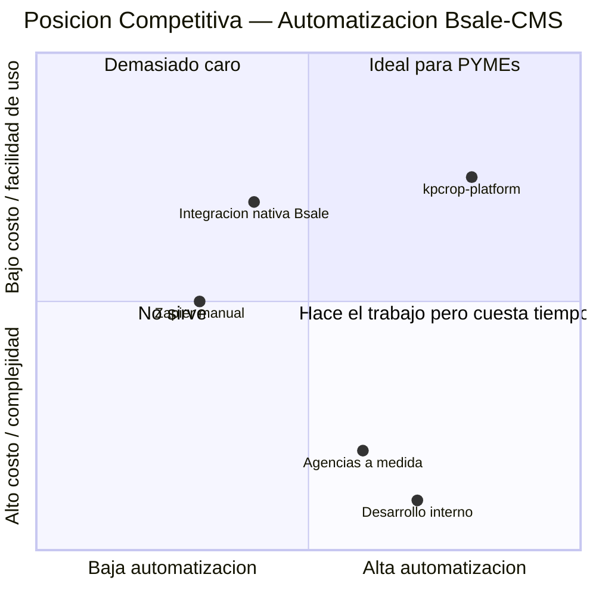
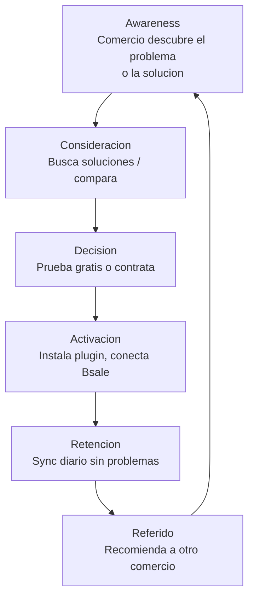

# Estudio de Mercado — kpcrop-latam-zollner-platform

**Fecha:** 2026-05-22
**Mercado primario:** Chile
**Mercado secundario:** LATAM (Mexico, Colombia, Peru)
**Version:** 1.0

---

## Resumen Ejecutivo

kpcrop-latam-zollner-platform es una plataforma SaaS que automatiza la sincronizacion de catalogo, stock y precios desde Bsale ERP/POS hacia los principales CMS de e-commerce. El mercado objetivo inmediato son los comercios chilenos que ya operan con Bsale y tienen tienda online en PrestaShop, WooCommerce u otro CMS compatible.

El dolor que resuelve es concreto y costoso: los comercios con Bsale deben actualizar manualmente sus precios y stock en dos sistemas cada vez que cambia algo en su inventario. Este proceso toma entre 2 y 10 horas semanales segun el volumen de productos y es fuente frecuente de errores (precios desactualizados, ventas de productos sin stock).

La plataforma no compite con Bsale — extiende su valor hacia el canal digital.

---

## 1. Contexto del Ecosistema Bsale

### 1.1 Posicion de Bsale en Chile

Bsale es el ERP/POS dominante entre las PYMEs chilenas en retail, gastronomia y servicios. Su adoption es alta por tres razones:

- Precio accesible para PYMEs (planes desde aprox. USD 30-50/mes segun integraciones)
- Cumplimiento del SII (boletas y facturas electronicos integrados)
- Fuerte presencia en retail fisico con lector de tarjetas integrado

Bsale tiene presencia en Mexico, Colombia y Peru, lo que abre la posibilidad de expansion LATAM con el mismo producto, aunque con menor penetracion de mercado que en Chile.

### 1.2 Brecha que Genera el Mercado

Bsale tiene un marketplace de integraciones propio, pero las integraciones disponibles son basicas y no cubren todos los CMS relevantes del mercado chileno. Ademas, la configuracion de webhooks en Bsale requiere proceso manual via email a soporte (no hay API de registro), lo que hace que la mayoria de los comercios no aprovechen la sincronizacion automatica.

El resultado es un mercado con una brecha estructural: empresas con ERP maduro (Bsale) y presencia digital (CMS propio) pero sin puente automatico entre ambos sistemas.

---

## 2. Tamano de Mercado (TAM / SAM / SOM)

### 2.1 Supuestos del Calculo

Los siguientes supuestos estan basados en datos publicos y estimaciones sectoriales:

| Supuesto | Valor | Fuente / Razon |
|---|---|---|
| PYMEs con e-commerce en Chile | ~45.000 | Camara de Comercio de Santiago / ACTI 2024 |
| Fraccion que usa Bsale como ERP/POS | ~15% | Estimado conservador — Bsale es lider de mercado |
| Fraccion con CMS compatible (PS, WC, Shopify, etc.) | ~60% de usuarios Bsale | Los CMS listados cubren ~80% del mercado CMS PYME |
| Willingness to pay por una herramienta de sync | ~70% | Las que tienen ambos sistemas tienen el dolor activo |
| Precio promedio mensual del producto | USD 25 | Tier Starter estimado |
| Tipo de cambio referencial | 1 USD = 950 CLP | |

### 2.2 TAM — Total Addressable Market

**Definicion:** Todos los comercios en Chile que usan Bsale y tienen una tienda online en cualquier CMS, independientemente de si buscan activamente una solucion de sync.

```
45.000 PYMEs con e-commerce
× 15% penetracion de Bsale
= ~6.750 empresas con Bsale + tienda online
```

```
TAM Chile = 6.750 empresas × USD 25/mes × 12 meses
TAM Chile = USD 2.025.000/año (~CLP 1.924 millones)
```

### 2.3 SAM — Serviceable Addressable Market

**Definicion:** Subconjunto del TAM al que el producto puede llegar con su integracion actual. Se filtra por CMS compatible (PrestaShop, WooCommerce, Shopify, Magento, Jumpseller, WordPress).

```
6.750 empresas con Bsale
× 60% usan un CMS compatible
= ~4.050 empresas alcanzables con el producto actual
```

```
SAM Chile = 4.050 empresas × USD 25/mes × 12 meses
SAM Chile = USD 1.215.000/año (~CLP 1.154 millones)
```

### 2.4 SOM — Serviceable Obtainable Market

**Definicion:** Fraccion realista del SAM que se puede capturar en los primeros 12-24 meses, considerando un equipo de 1 programador + 1 disenador, sin fuerza de ventas dedicada, con un producto que empieza en MVP.

| Escenario | Supuesto | Clientes | MRR a 12m | ARR |
|---|---|---|---|---|
| Conservador | 0,5% del SAM | ~20 clientes | USD 500 | USD 6.000 |
| Base | 1,5% del SAM | ~60 clientes | USD 1.500 | USD 18.000 |
| Optimista | 3% del SAM | ~120 clientes | USD 3.000 | USD 36.000 |

**Nota:** El escenario base a 12 meses (~60 clientes) es alcanzable con distribucion via canales organicos y boca a boca en la comunidad Bsale. El escenario optimista requiere presencia activa en el marketplace de Bsale y alianzas con agencias.

### 2.5 Expansion LATAM

Bsale opera en Mexico, Colombia y Peru. Aplicando supuestos similares con menor penetracion de Bsale en esos mercados (~5-8% del mercado de PYMEs con e-commerce):

| Pais | PYMEs e-commerce est. | Fraccion Bsale | SAM estimado/año |
|---|---|---|---|
| Mexico | ~200.000 | 5% | USD 1.800.000 |
| Colombia | ~60.000 | 6% | USD 648.000 |
| Peru | ~40.000 | 7% | USD 504.000 |

**SAM LATAM total (sin Chile):** ~USD 2.952.000/año

La expansion LATAM no requiere cambios de producto — Bsale tiene API unificada. Requiere adaptacion de billing a monedas locales (MercadoPago ya esta en el stack) y soporte en espanol, que ya es el idioma del producto.

---

## 3. Segmentacion de Clientes

### 3.1 Criterios de Segmentacion

| Dimension | Segmento A | Segmento B | Segmento C |
|---|---|---|---|
| Tamano | Micropyme (1-5 emp.) | PYME mediana (5-30 emp.) | Agencia digital |
| CMS | PrestaShop / WooCommerce | Shopify / Magento | Multiple (gestiona N clientes) |
| Volumen catalogo | 50-500 productos | 500-5000 productos | Variable |
| Dolores | Tiempo manual, errores de stock | Inconsistencias, velocidad | Escalabilidad, reporte multi-cliente |
| Willingnes to pay | USD 15-25/mes | USD 30-60/mes | USD 80-150/mes |

### 3.2 Criterios de Calificacion (BANT adaptado)

Un prospecto calificado cumple:
- **Budget:** Paga un plan Bsale activo (tiene el ERP)
- **Authority:** Es el dueno del negocio o el encargado de TI
- **Need:** Actualiza precios o stock en el CMS mas de 2 veces por semana
- **Timeline:** Tiene la tienda online activa (no es proyecto futuro)

---

## 4. Analisis Competitivo

### 4.1 Mapa Competitivo



### 4.2 Tabla Comparativa de Competidores

| Competidor | Tipo | Fortalezas | Debilidades | Precio estimado |
|---|---|---|---|---|
| Integracion nativa Bsale | Marketplace Bsale | Confianza de marca, sin costo adicional | CMS limitados, configuracion basica, sin sync automatico real | Incluida con Bsale |
| Agencias a medida | Servicio profesional | Totalmente personalizado | Alto costo inicial (USD 1.000-5.000), sin mantenimiento autonomo, no escala | USD 1.000-5.000 setup + USD 200-500/mes mantenimiento |
| Desarrollo interno | DIY | Control total | Requiere programador PHP/JS, meses de desarrollo, sin soporte | Costo de programador: USD 3.000-8.000/mes |
| Zapier / Make | Integracion generica | Flexible, sin codigo | Sin conector Bsale nativo, requiere configuracion tecnica, cara para alto volumen | USD 20-100/mes + horas de configuracion |
| WooSync / similares | SaaS focado en WC | Especializado WooCommerce | Solo WooCommerce, sin soporte Bsale especifico | USD 10-50/mes |

### 4.3 Ventaja Competitiva Diferenciada

kpcrop-latam-zollner-platform tiene ventajas estructurales que los competidores no pueden replicar facilmente:

1. **Natividad Bsale:** El producto esta construido especificamente sobre la API de Bsale, con conocimiento profundo de su modelo de datos (variantes, listas de precios, sucursales, IVA neto/bruto). Las integraciones genericas ignoran estas particularidades.

2. **Multi-CMS desde el diseno:** La arquitectura hub-and-spoke permite soportar 6 CMS con un nucleo comun. Un cliente que migre de PrestaShop a Shopify no necesita cambiar de proveedor.

3. **Arquitectura reactiva (webhooks):** Mientras el polling es la norma en la competencia, la arquitectura basada en webhooks de Bsale permite sync en menos de 30 segundos tras un cambio, sin consumir recursos innecesarios.

4. **Precio PYME:** El punto de precio objetivo (USD 15-30/mes) esta disenadopara ser la primera herramienta de automatizacion que un comerciante contrata — no compite con ERPs ni con agencias enterprise.

### 4.4 Riesgos Competitivos

| Riesgo | Probabilidad | Impacto | Mitigacion |
|---|---|---|---|
| Bsale lanza integracion nativa mejorada | Media | Alto | Velocidad de ejecucion; establecer base de clientes antes de que Bsale invierta aqui |
| Jugador LATAM con mas recursos replica el producto | Baja (corto plazo) | Alto | Profundidad tecnica y soporte en espanol como moat |
| Un cliente grande hace el desarrollo internamente | Alta | Bajo | Son clientes fuera del SAM (no son PYME) |
| Bsale cierra la API publica | Muy baja | Critico | Monitorear terminos de la API; diversificar hacia otros ERP si crecen |

---

## 5. Propuesta de Valor

### 5.1 Declaracion de Valor

> Para los comercios chilenos que usan Bsale como ERP y tienen tienda online, kpcrop es el puente automatico que mantiene sincronizados el catalogo, el stock y los precios entre Bsale y su CMS — en tiempo real, sin trabajo manual y sin necesidad de programadores.

### 5.2 Beneficios por Segmento

| Segmento | Beneficio principal | Metrica de exito |
|---|---|---|
| Micropyme | Ahorra 2-8 horas/semana de actualizacion manual | Horas recuperadas |
| PYME mediana | Elimina ventas de productos sin stock / precios desactualizados | Tasa de error en pedidos |
| Agencia digital | Gestiona N clientes con Bsale desde un dashboard | Clientes gestionados por hora |

---

## 6. Canales de Adquisicion

### 6.1 Funnel de Adquisicion



### 6.2 Canales por Etapa

| Canal | Etapa | Costo | Potencial | Prioridad MVP |
|---|---|---|---|---|
| Marketplace de Bsale | Awareness / Decision | Bajo (listing gratuito o bajo costo) | Alto — trafico calificado | Alta |
| Comunidades Facebook (grupos Bsale, PrestaShop Chile) | Awareness | Tiempo del fundador | Medio — communidad activa | Alta |
| SEO / Blog (contenido tecnico Bsale) | Awareness largo plazo | Medio | Alto a 6+ meses | Media |
| Alianzas con agencias PrestaShop / WordPress | Decision / Referido | Comision 20-30% | Alto — canal multiplicador | Alta |
| Google Ads (keywords Bsale + CMS) | Decision | USD 200-500/mes | Medio — CPC competitivo | Baja (post-MVP) |
| Referidos activos (descuento por referir) | Referido | Costo en descuentos | Alto si base de clientes activa | Media |
| YouTube / tutoriales de instalacion | Activacion / Consideracion | Tiempo del fundador | Medio | Media |

### 6.3 Canal Prioritario: Marketplace de Bsale

El marketplace de integraciones de Bsale es el canal de mayor leverage porque:
- El trafico ya esta calificado (usuarios activos de Bsale)
- La confianza de marca de Bsale reduce la friccion de conversion
- No requiere gasto en adquisicion pagada

**Accion:** Listar el producto en el marketplace de Bsale como primera accion de go-to-market, incluso antes del lanzamiento oficial.

### 6.4 Canal Secundario: Agencias Digitales

Las agencias que implementan PrestaShop o WooCommerce para sus clientes son canales de distribucion naturales. Un acuerdo de referido con 10 agencias activas puede generar un flujo constante de clientes sin gasto en publicidad.

**Modelo de referido sugerido:** 20% de la primera mensualidad o 1 mes gratis para el cliente referido.

---

## 7. Barreras de Entrada y Moat

| Barrera | Descripcion | Solidez |
|---|---|---|
| Conocimiento del modelo de datos Bsale | Variantes, precios netos, sucursales — requiere meses de experiencia con la API | Media (replicable en 3-6 meses por un competidor dedicado) |
| Base de clientes y reputacion | Una vez que 50+ comercios dependen del producto, el switching cost es alto | Alta (crece con el tiempo) |
| Integraciones multi-CMS | Soportar 6 CMS con calidad es costoso de replicar | Media-Alta |
| Alianzas con agencias | Relaciones comerciales exclusivas con agencias clave | Media |

---

## 8. Preguntas Pendientes para el Fundador

Las siguientes preguntas, al ser respondidas, refinarian significativamente este estudio:

1. **Validacion del tamano de mercado:** ¿Has encontrado datos de cuantas empresas tienen Bsale activo en Chile? El numero de 6.750 es una estimacion — Bsale podria compartirlo si se les contacta como potencial partner.

2. **Relacion con Bsale:** ¿Existe o es viable una relacion de partner formal con Bsale? Un listing oficial en su marketplace requiere aprobacion y posiblemente un revenue share. ¿Ya se exploro esta via?

3. **Agencias como canal:** ¿Tienes contacto con agencias que implementan PrestaShop o WooCommerce en Chile? Una alianza temprana con 2-3 agencias puede ser el diferencial en velocidad de adquisicion de clientes.

4. **Competidores no identificados:** ¿Has buscado en el marketplace de Bsale si existe algun producto que haga esto hoy? Es posible que existan integraciones de nicho no visibles via Google.

5. **Definicion de exito a 12 meses:** ¿Que MRR considerarias un exito para decidir continuar invirtiendo en el producto? Esto permite calibrar si el escenario conservador (USD 500 MRR) o base (USD 1.500 MRR) son aceptables o insuficientes.
