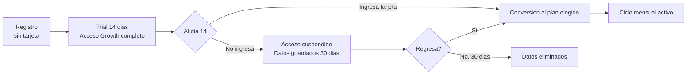

# Estrategia de Pricing — kpcrop-latam-zollner-platform

**Fecha:** 2026-05-22
**Mercado primario:** Chile
**Version:** 1.0

---

## Resumen Ejecutivo

Se recomienda un modelo **SaaS de suscripcion mensual con 3 tiers** (Starter / Growth / Agency) y un periodo de prueba gratuito de 14 dias sin tarjeta de credito. Este modelo maximiza el valor de vida del cliente (LTV), genera ingresos predecibles y se alinea con la expectativa del mercado PYME chileno que ya paga suscripciones mensuales por Bsale.

---

## 1. Evaluacion de Modelos de Negocio

### 1.1 Comparativa de Modelos

| Modelo | Como funciona | Pros | Contras | Fit para este producto |
|---|---|---|---|---|
| SaaS suscripcion mensual | Precio fijo por tier/mes | Ingresos predecibles, LTV alto, facil de entender | Requiere propuesta de valor clara para justificar mensualidad | Alto |
| Freemium + premium | Tier gratuito con limitaciones, premium de pago | Adquisicion rapida, boca a boca | Riesgo de abuso del tier gratis, costo de infraestructura sin retorno | Medio |
| Pago por uso | Precio por sync ejecutado o producto sincronizado | Escala con el cliente | Impredecible para el cliente y para el negocio, complejo de comunicar | Bajo |
| Licencia perpetua | Pago unico por version | Simple para el cliente | Sin ingresos recurrentes, no compatible con SaaS/hosting | No aplica |
| Revenue share | % de ventas generadas por la tienda online | Alineado con exito del cliente | Imposible de medir con precision, requiere acceso a datos de ventas | No aplica |

### 1.2 Por Que SaaS de Suscripcion Mensual

**Benchmarks de productos similares:**

| Producto | Modelo | Precio base | Observacion |
|---|---|---|---|
| Shopify App Store (apps de sync) | Suscripcion mensual | USD 10-50/mes | Modelo estandar para integraciones de CMS |
| WooSync (WC sync) | Suscripcion mensual | USD 15-49/mes | Referente directo de categoria |
| Zapier | Suscripcion + uso | USD 20-100/mes | Integraciones genericas — mas caro para el caso de uso especifico |
| n8n Cloud | Suscripcion mensual | USD 20-50/mes | Alternativa tecnica pero requiere configuracion |
| Klaviyo (integracion email) | Suscripcion mensual | USD 20-150/mes | Mismo modelo de valor para integraciones de e-commerce |
| Stock Sync (Shopify) | Suscripcion mensual | USD 5-49/mes | Competidor indirecto — sync de stock unidireccional |

**Conclusion:** El mercado de integraciones para e-commerce PYME convergio en suscripcion mensual entre USD 15 y USD 50 para tiers de entrada. El precio de entrada mas bajo que funciona en este segmento sin degradar la percepcion de valor es USD 15/mes.

### 1.3 Por Que No Freemium

El freemium requiere que el tier gratuito sea lo suficientemente util para generar viralizacion, pero lo suficientemente limitado para empujar conversion. El problema con este producto:

- El sync de productos requiere infraestructura (Railway, PostgreSQL, Redis, BullMQ) con costo real por tenant
- Un tier gratuito sin limitaciones importantes incentiva que el cliente nunca pague
- En Chile, el mercado objetivo (comercio con Bsale) ya esta acostumbrado a pagar por herramientas SaaS — el freemium no es necesario para superar la friccion

**La alternativa correcta al freemium es un trial de 14 dias sin tarjeta de credito**, que reduce la friccion de prueba sin comprometer ingresos.

---

## 2. Modelo de Pricing Recomendado

### 2.1 Estructura de Tiers

| | **Starter** | **Growth** | **Agency** |
|---|---|---|---|
| **Precio mensual (USD)** | USD 19 | USD 49 | USD 120 |
| **Precio mensual (CLP)** | CLP 18.050 | CLP 46.550 | CLP 114.000 |
| **Precio anual (USD, 20% dto.)** | USD 182/año | USD 470/año | USD 1.152/año |
| **Tiendas incluidas** | 1 | 3 | Ilimitadas |
| **CMS soportados** | 1 (a eleccion) | Todos (6 CMS) | Todos (6 CMS) |
| **Sync automatico** | No | Si | Si |
| **Frecuencia de sync automatico** | — | Cada 15 min | En tiempo real (webhook) |
| **Sync manual** | Si | Si | Si |
| **Productos sincronizados** | Hasta 1.000 | Hasta 10.000 | Ilimitados |
| **Historial de syncs** | 7 dias | 30 dias | 90 dias |
| **Soporte** | Email (72h) | Email prioritario (24h) | Chat dedicado (8h) |
| **Dashboard multi-tienda** | No | No | Si |
| **Reportes de sync** | Basico | Avanzado | Avanzado + exportacion |
| **Periodo de prueba** | 14 dias gratis | 14 dias gratis | 14 dias gratis |

### 2.2 Justificacion de Precios

**Starter (USD 19/mes):**
- Punto de entrada por debajo de la barrera psicologica de USD 20
- Recupera el costo de infraestructura por tenant (~USD 3-5/mes en Railway) con margen
- Comparable con Shopify App Store para apps de sync (USD 10-25/mes)
- El limite de 1.000 productos cubre la mayoria de los comercios pequenos en Chile

**Growth (USD 49/mes):**
- Precio natural para PYMEs medianas que ya validan el producto con Starter
- Upsell por sync automatico: el dolor de actualizar manualmente cada dia es el motivador
- Competitivo vs. desarrollo a medida (USD 500-1.000 una sola vez) cuando se calcula el costo total de propiedad a 12 meses (USD 49 × 12 = USD 588 vs. mantenimiento recurrente)
- Ratio Starter:Growth = 2,57x — dentro del rango tipico para upsell de integraciones (2x-3x)

**Agency (USD 120/mes):**
- Propuesta de valor diferente: el cliente no es el comercio, es la agencia que gestiona varios comercios
- USD 120/mes para 5 clientes = USD 24/cliente — mas barato que Starter si se escala
- El LTV de una agencia es 5-10x mayor que un comercio individual
- Sin limite de tiendas crea un incentivo para que la agencia sume mas clientes bajo su cuenta

### 2.3 Ancla de Precio y Efecto Decoy

La estructura de tres tiers usa un efecto de ancla deliberado:
- El precio de Agency (USD 120) hace que Growth (USD 49) se perciba como la opcion razonable
- Growth tiene el ratio caracteristicas/precio mas atractivo — es el tier de mayor margen y mayor volumen esperado
- Starter existe para capturar la "prueba con dinero de verdad" y convertir a Growth tras el primer mes

---

## 3. Mecanica de Billing

### 3.1 Ciclo de Facturacion

- Mensual por defecto; anual con 20% de descuento
- Facturacion en USD para mantener estabilidad frente a fluctuaciones del CLP
- Pago con tarjeta via Stripe (internacionales y chilenas con pago en cuotas sin interes via Khipu/Transbank donde aplique)
- Pago via MercadoPago para clientes que prefieren no usar tarjeta de credito internacional
- Emision de factura electronica para clientes que la requieren (prioridad baja en MVP — resolver manualmente al inicio)

### 3.2 Trial y Conversion



**Nota:** El trial en el plan Growth (no Starter) maximiza la conversion porque el usuario experimenta el sync automatico — la feature de mayor valor — durante el trial. Si el trial fuera en Starter (sync solo manual), muchos usuarios no verian el valor diferencial del producto.

### 3.3 Suspension y Reactivacion

Ver flujo detallado en `/docs/licensing/README.md`. Resumen:
- Pago fallido: 3 intentos automaticos en 7 dias antes de suspension
- Suspension: sync se detiene, datos se mantienen 30 dias
- Reactivacion: inmediata al registrar pago exitoso

---

## 4. Estrategia de Upsell y Expansion Revenue

### 4.1 Triggers de Upgrade Natural

| Evento | De | A | Mensaje |
|---|---|---|---|
| Cliente alcanza limite de 1.000 productos | Starter | Growth | "Tu catalogo tiene 1.050 productos. Actualiza a Growth para sincronizar el catalogo completo" |
| Cliente tiene 2 tiendas | Starter | Growth | "Anade tu segunda tienda con Growth" |
| Cliente pregunta por sync automatico | Starter | Growth | "El sync automatico cada 15 min esta disponible en Growth" |
| Agencia con 3+ tiendas de clientes | Growth | Agency | "Gestiona todos tus clientes desde un dashboard con Agency" |

### 4.2 Add-ons Futuros (v2+)

Posibles add-ons que se pueden monetizar sobre cualquier plan base:

| Add-on | Precio sugerido | Descripcion |
|---|---|---|
| Sync de ordenes (CMS → Bsale) | +USD 15/mes | Registra las ventas del e-commerce como documentos en Bsale |
| Dropshipping (Bsale como proveedor) | +USD 25/mes | Permite a otros comercios vender el catalogo como dropshipper |
| Sync en tiempo real (Starter) | +USD 10/mes | Webhooks en lugar de polling para plan Starter |
| Soporte prioritario | +USD 20/mes | SLA de 4 horas para cualquier plan |

---

## 5. Proyeccion de Ingresos a 12 Meses

### 5.1 Supuestos del Modelo

| Supuesto | Valor |
|---|---|
| Mes de inicio facturacion real | Mes 3 (MVP listo) |
| Distribucion de planes | 50% Starter / 35% Growth / 15% Agency |
| Churn mensual (primer ano) | 5% conservador / 3% base / 2% optimista |
| Conversion trial → pago | 20% conservador / 30% base / 40% optimista |
| Crecimiento de nuevos clientes/mes | 3 / 6 / 10 |
| MRR promedio por cliente | USD 35 (mix de planes) |

### 5.2 Escenario Conservador

| Mes | Clientes nuevos | Churn | Clientes activos | MRR |
|---|---|---|---|---|
| 3 | 3 | 0 | 3 | USD 105 |
| 4 | 3 | 0 | 6 | USD 210 |
| 5 | 3 | 0 | 9 | USD 315 |
| 6 | 3 | 1 | 11 | USD 385 |
| 7 | 3 | 1 | 13 | USD 455 |
| 8 | 3 | 1 | 15 | USD 525 |
| 9 | 3 | 1 | 17 | USD 595 |
| 10 | 3 | 1 | 19 | USD 665 |
| 11 | 3 | 1 | 21 | USD 735 |
| 12 | 3 | 1 | 23 | **USD 805** |

**MRR al mes 12 (conservador): ~USD 800**
**ARR equivalente: ~USD 9.600**

### 5.3 Escenario Base

| Mes | Clientes nuevos | Churn | Clientes activos | MRR |
|---|---|---|---|---|
| 3 | 5 | 0 | 5 | USD 175 |
| 4 | 6 | 0 | 11 | USD 385 |
| 5 | 6 | 1 | 16 | USD 560 |
| 6 | 6 | 1 | 21 | USD 735 |
| 7 | 6 | 1 | 26 | USD 910 |
| 8 | 6 | 1 | 31 | USD 1.085 |
| 9 | 6 | 2 | 35 | USD 1.225 |
| 10 | 6 | 2 | 39 | USD 1.365 |
| 11 | 6 | 2 | 43 | USD 1.505 |
| 12 | 6 | 2 | 47 | **USD 1.645** |

**MRR al mes 12 (base): ~USD 1.650**
**ARR equivalente: ~USD 19.800**

### 5.4 Escenario Optimista

Requiere: listing activo en marketplace Bsale + 3-5 alianzas con agencias.

| Mes | Clientes activos | MRR |
|---|---|---|
| 3 | 8 | USD 280 |
| 6 | 35 | USD 1.225 |
| 9 | 70 | USD 2.450 |
| 12 | 110 | **USD 3.850** |

**MRR al mes 12 (optimista): ~USD 3.850**
**ARR equivalente: ~USD 46.200**

### 5.5 Benchmark de Rentabilidad

El punto de equilibrio operativo se alcanza aproximadamente cuando:

```
Costos mensuales fijos estimados:
- Railway (infraestructura): USD 80-200/mes (escala con tenants)
- Stripe fees: ~2.9% + USD 0.30 por transaccion
- Dominio + SSL: USD 2/mes
- Herramientas (email, monitoreo): USD 30-50/mes
Total fijo estimado: USD 150-270/mes

Break-even: ~8-10 clientes activos en plan Growth
```

Con el escenario conservador, el break-even se alcanza aproximadamente en el mes 5-6 desde el inicio de facturacion.

---

## 6. Preguntas Pendientes para el Fundador

1. **Sensibilidad de precio en Chile:** ¿Has validado el precio de USD 19/mes con algun comercio potencial? Una conversacion con 5 prospectos puede confirmar o ajustar el tier Starter sin invertir en desarrollo.

2. **Factura electronica:** ¿Los clientes objetivo necesitan factura electronica del servicio? Esto requiere integracion con el SII o un proveedor como Factura.com, lo que agrega complejidad al MVP de billing.

3. **Pago en CLP vs. USD:** ¿Prefieres cobrar en CLP (mas simple para el cliente chileno) o en USD (mas estable para tu contabilidad)? Stripe permite cobrar en CLP, pero la conversion de tipos de cambio agrega friccion si el precio se mueve mucho.

4. **Revenue share con Bsale:** Si Bsale exige un porcentaje para estar en su marketplace, ¿estas dispuesto a cederlo? Un 20-30% de revenue share reduciria el MRR efectivo pero podria multiplicar el volumen de adquisicion.

5. **Planes anuales:** ¿Prefieres priorizar cash flow (cobrar anual con descuento) o LTV (mantener mensual para reducir barrera de entrada)? En la etapa actual, el pago mensual reduce la friccion; el anual puede introducirse en v1.1 cuando ya hay base de clientes.
