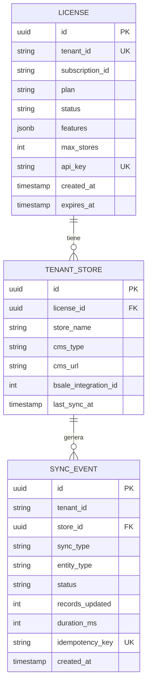
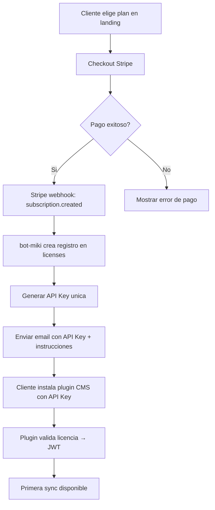
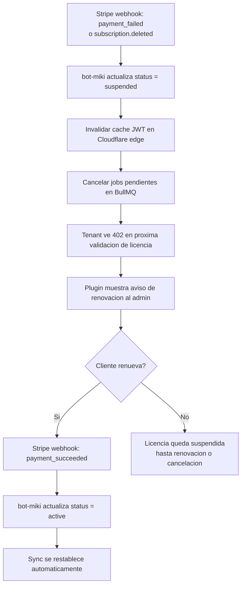

# Licenciamiento y Billing

## Planes

Ver estrategia de pricing completa en [`business/pricing-strategy.md`](../business/pricing-strategy.md).

### Canal Agencias (PRIMARIO — v2.0)

| Plan | Clientes | White-label | Sync | Precio |
|---|---|---|---|---|
| **Agency Standard** | Hasta 15 | No | Cada 15 min | USD 99/mes |
| **Agency Pro** | Ilimitados | Si | Webhook (tiempo real) | USD 199/mes |

### Canal Directo (SECUNDARIO)

| Plan | Tiendas | Sync Auto | Precio |
|---|---|---|---|
| **Starter** | 1 | No (manual) | USD 19/mes |
| **Growth** | 3 | Si (cada 15 min) | USD 49/mes |

**Features por plan en el modelo de datos:**

| Plan | `features` en DB | `max_stores` |
|---|---|---|
| `starter` | `['sync_manual']` | 1 |
| `growth`  | `['sync_manual', 'sync_auto', 'sync_prices']` | 3 |
| `agency`  | `['sync_manual', 'sync_auto', 'sync_prices', 'dropshipping', 'multi_store']` | 50 |

El billing se gestiona en Stripe. MercadoPago como opcion adicional para pagos en CLP.

---

## Modelo de Licencia por Tenant



---

## Flujo de Activacion



---

## Flujo de Suspension



---

## Modelo de Agencias

Una agencia gestiona N tiendas de N clientes bajo una sola cuenta. El modelo de datos soporta esto con sub-cuentas:

```
Agency Account (license: plan=agency, max_stores=50)
├── Store: cliente-a.mitienda.cl (cms: wordpress)
├── Store: cliente-b.shop.com (cms: shopify)
├── Store: cliente-c.cl (cms: prestashop)
└── ...hasta max_stores
```

Cada tienda tiene su propio `api_key` hijo derivado del `api_key` de la agencia. Si la agencia suspende una tienda, el token de esa tienda se invalida sin afectar a las demas.

---

## Metricas Clave de Licencias

| Metrica | Descripcion | Alerta si |
|---|---|---|
| `licenses.active` | Total de licencias activas | < umbral historico |
| `licenses.suspended` | Licencias suspendidas por pago | Crece sostenidamente |
| `licenses.churn_rate` | Cancelaciones / total (mensual) | > 5% |
| `revenue.mrr` | Monthly Recurring Revenue | Cae mes a mes |
| `sync.success_rate_by_plan` | Tasa de exito de sync por plan | < 95% en cualquier plan |
