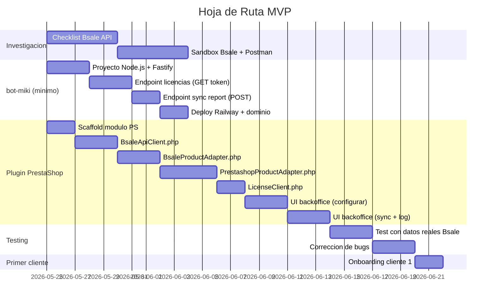

# Definicion del MVP

El MVP es el minimo que le demuestra valor real a un primer cliente de pago. No es un prototipo — es un producto funcional con el subconjunto mas pequeño de features que justifica una suscripcion.

---

## Criterio de MVP

> Un comercio chileno con PrestaShop y Bsale puede sincronizar sus productos manualmente con un clic desde el backoffice de PrestaShop, sin errores, con feedback visual del resultado.

Eso es todo. No sync automatico. No dropshipping. No dashboard de agencias. No multi-CMS todavia.

---

## Scope MVP — Lo que SI entra

### Plugin PrestaShop (cms-prestashop)
- [x] Scaffold del modulo PHP (`bsalesync/bsalesync.php`) — install/uninstall, tab, SQL
- [x] `BsaleApiClient.php` — paginacion, rate limiting, manejo de errores
- [x] `LicenseClient.php` — obtiene y cachea JWT de bot-miki
- [x] `BsaleSyncService.php` — orquesta sync products/stock/prices, idempotente por SKU
- [x] Tests PHPUnit para BsaleApiClient y BsaleSyncService
- [x] CLI `bsalesync/cli/sync.php` para sync por linea de comandos / cron de PS
- [x] `AdminBsaleSyncController.php` (scaffold base)
- [ ] Pantalla de configuracion: ingresar Bsale API Token + API Key de licencia (UI completa)
- [ ] Verificacion de conexion a Bsale al guardar (muestra nombre de la empresa)
- [ ] Barra de progreso o spinner durante el sync
- [ ] Resultado del sync: "N productos actualizados / X errores" (UI)
- [ ] Log de los ultimos 10 syncs en la pantalla de configuracion
- [ ] Soporte verificado en PrestaShop 1.7.x y 8.x

### bot-miki (demonio — funcionalidad minima)
- [x] Endpoint `GET /v1/license/token` — valida la API Key y devuelve JWT (`routes/license.ts`)
- [x] Endpoint `POST /v1/sync/report` — recibe el reporte del sync del plugin (`routes/sync-report.ts`)
- [x] Endpoint `POST /v1/admin/tenants` — crea tenant + licencia + genera API Key (`routes/admin.ts`)
- [x] Endpoint `POST /v1/webhooks/bsale` — recibe webhooks y encola jobs (`routes/webhooks.ts`)
- [x] Scheduler + Worker de sync automatico con BullMQ (`scheduler/index.ts`, `workers/sync-worker.ts`)
- [x] BsaleHttpClient con rate limiting + reintentos (`infrastructure/bsale-http-client.ts`)
- [x] Schema de BD completo (licenses, tenant_stores, sync_events, snapshots, etc.) (`infrastructure/database.ts`)
- [x] CanonicalProduct model con Zod (`packages/shared`)
- [x] CmsAdapter interface (`packages/shared`)
- [ ] Deployment en Railway (sin HA, sin escalado — un solo proceso)

### Infraestructura
- [ ] Dominio `api.kpcrop.com` apuntando al demonio en Railway
- [ ] Certificado SSL activo
- [ ] PostgreSQL en Railway con tabla `licenses`
- [ ] Variables de entorno configuradas (Bsale no se toca aqui — eso es del cliente)

---

## Scope MVP — Lo que NO entra (diferido)

| Feature | Por que se difiere |
|---|---|
| Sync automatico / scheduler | Requiere cola BullMQ + Railway workers. Mas complejidad sin validacion de mercado |
| Sync de clientes | Baja prioridad para primer cliente — los productos son el dolor principal |
| Sync de ordenes | Requiere escritura en Bsale — mas riesgo, validar primero si Bsale API lo soporta bien |
| Sync de guias de despacho | Idem ordenes |
| Dashboard web para agencias | No hay agencias en MVP — hay un solo cliente |
| Multi-CMS (WordPress, Shopify...) | PrestaShop primero; otros CMS cuando el modelo de negocio este validado |
| Dropshipping | Feature complejo — segunda fase |
| Sync de variantes de productos | Si Bsale soporta variantes, puede ser complejidad extra para MVP; evaluar con cliente real |
| Alertas y observabilidad completa | En MVP: logs basicos en Railway. Axiom/Grafana en v1.1 |

---

## Definition of Done del MVP

Un MVP esta completo cuando:

1. Un comercio **instala el modulo** en su PrestaShop desde cero en menos de 10 minutos siguiendo la documentacion
2. El comercio **configura** Bsale API Token + API Key de licencia sin necesitar soporte tecnico
3. El comercio hace clic en "Sincronizar productos" y **todos sus productos de Bsale aparecen en PrestaShop** con precio y stock correcto
4. Si el sync falla (Bsale no disponible, token incorrecto), el comercio **ve un mensaje de error util**, no una pantalla blanca
5. El comercio puede **repetir el sync** sin crear productos duplicados (idempotencia por `reference` = SKU de Bsale)
6. El modulo funciona en un PrestaShop con **hasta 5000 productos** sin timeout de PHP (usa procesamiento por lotes)

---

## Orden de Construccion

---

## Metricas de Exito del MVP

| Metrica | Target |
|---|---|
| Tiempo de instalacion y configuracion | < 10 minutos |
| Tasa de exito del sync (productos sin error) | > 95% |
| Tiempo de sync para 1000 productos | < 5 minutos |
| Tiempo de sync para 5000 productos | < 20 minutos |
| Crashes / errores criticos en primer mes | 0 |
| NPS del primer cliente despues de 30 dias de uso | > 8 |

---

## Lo que Aprenderemos con el MVP

Antes de construir sync automatico, dropshipping o multi-CMS, el MVP responde:

1. **¿El dolor es real?** ¿El comercio realmente usa el sync manual o lo usa una vez y lo olvida?
2. **¿Cuantos productos tiene un cliente tipico?** Afecta el diseño del sistema de paginacion y el tiempo de sync
3. **¿Donde falla la integracion Bsale?** Los edge cases del modelo de datos de Bsale (variantes, listas de precios, sucursales) solo aparecen con datos reales
4. **¿Cuanto vale para el cliente?** Informa el modelo de precios antes de invertir en features de escala
5. **¿Prefiere sync manual o automatico?** Si el cliente no usa el manual, el automatico tampoco lo usara — o al reves
